# 公司金融 Corporate Finance

英文授课，故笔记使用英文。会有中文注释。

英文斜体和引用为参考教材的阅读记录，作为课堂内容的补充。

## Lecture 1

date: 2024/9/9

Absent for some reasons.

## Lecture 2: Discounted Cash Flow Valuation

date: 2024/9/14

### 1. Present Value and Future Value

$1 today is worth more than expectation of $1 next year because:

- A bank would pay interest on $1.
- Inflation makes next year's $1 less valuable than today's.
- Uncertainty of receiving next year's $1.

*我想，折扣因子（discount）就是对上述因素的综合反映。*

The relationship between $1 today and $1 in the future is called **time value of money**.

**Present Value** is the value of future money today.

**Future Value** is the value of today's money in the future.

We pay more attention to present value.

### 2. One Time Period Case

*现金流过了一个周期后的情况。*

Present value of a cash flow received 1 period from now is:

$$
PV = C_0 = \frac{C_1}{1 + r}
$$

Future value of a cash flow received today is:

$$
FV = C_1 = C_0(1 + r)
$$

$ C_1 $ is cash flow at date 1. $C_0$ is the cash flow at date 0. $r$ is the  appropriate interest rate, or the discount rate. Dividing future cash flow by $1 + r$ is called **discounting**.

### 3. Net Present Value (NPV) of Investment

*投资净现值。*

NPV helps us determine the exact cost or the benefit of a decision.

$$
NPV = -cost + PV
$$

**NPV rule**: Accept a project if NPV > 0.

### 4. The Multiperiod Case

The process of calculating the future value of a present cash is **compounding**. The opposite of discounting.

**Simple Interest** vs. **Compound Interest**: When cash is invested at compound interest, each interest payment is reinvested. With simple interest, the interest is not reinvested.

Present value of a cash flow received $t$ periods from now is:

$$
PV = C_0 = \frac{C_t}{(1 + r)^t}
$$

Future value of a cash flow received today is:

$$
FV = C_t = C_0(1 + r)^t
$$

We are looking for the number of years to double the money. Let $C_n = 2C_0$, we have $n = \frac{ln2}{ln(1 + r)}$. Then we get **rule of 72**: $n = \frac{72}{100r}$.

NPV is additive:

$$
\begin {split}
NPV &= -C_0 + \frac{C_1}{1 + r} + \frac{C_2}{(1 + r)^2} + ... + \frac{C_t}{(1 + r)^t}\\
&= -C_0 + \sum^t_{i = 1}\frac{C_i}{(1 + r)^i}
\end {split}
$$

### 5. Compounding Periods

Above are the cases when compounding and discounting occur yearly. What if compounding occurs semiannually? Quarterly? Monthly? Daily? ...

The future value of compounding an investment $m$ times a year for one year is:

$$
FV = C_0 \times (1 + \frac{r}{m})^m
$$

$r$ is **stated annual interest rate (SAIR, 名义年利率)**, also called **annual percentage rate (APR, 年百分利率).**

**EAIR (实际年利率)** is **effective annual percentage rate** or the **effective annual yield (EAY)**, which can be calculated as:

$$
EAIR = (1 + \frac{SAIR}{m})^m - 1
$$

With **continuous compounding**, the value at the end of $t$ years is:

$$
FV = C_0 \times e^{rt}
$$

$C_0$ is initial investment, $r$ is the SAIR and $e$ is a constant as you know.

*当你令m趋于无穷时，将$\frac{r}{m}$换元，然后根据熟知的$(\frac{1}{1 + n})^n = e$就能得到上面的式子。*

simple returns are not additive, but continuously-compounded returns are additive.

*原因：指数相乘，幂相加*

### 6. Some Applications

#### (1) Perpetuity (永续年金)

A constant stream of cash flows without ends.

$$
PV = \frac{C}{1 + r} + \frac{C}{(1 + r)^2} + \frac{C}{(1 + r)^3} + ... = \frac{C}{r}
$$

*等比级数。*

*我理解永续年金为每年给你固定金额$C$的钱。*

#### (2) Growing Perpetuity (永续增长年金)

Cash flows grow at a constant rate indefinitely.

$$
\begin {split}
PV &= \frac{C}{1 + r} + \frac{C(1 + g)}{(1 + r)^2} + \frac{C(1 + g)^2}{(1 + r)^3} + ...\\
&= \frac{C}{r - g} \text{ (g < r)}
\end {split}
$$

*等比级数结论：当$q$小于1时，收敛于$\frac{a}{1 - q}$，$a$为首项。*

*可以这样理解、记忆上面的公式：先提取公因式$\frac{1}{1 + r}$，剩余的部分就是第一项为$C$，公比为$\frac{1 + g}{1 + r}$的等比级数。*

#### (3) Annuity (年金)

A constant payment for a fixed number of periods.

$$
\begin {split}
PV &= \frac{C}{1 + r} + ... + \frac{C}{(1 + r)^t}\\
&= C \times [\frac{1}{r} - \frac{1}{r(1 + r)^t}]\\
&= C \times A^t_r
\end {split}
$$

$[\frac{1}{r} - \frac{1}{r(1 + r)^t}]$ or $A^t_r$ is called **annuity factor**.

The relationship between perpetuity and annuity is $\text{PV of Annuity} = \text{PV of Perpetuity} - \text{PV of Perpetuity Starting from Date t+1}$.

#### (4) Growing Annuity (增长年金)

Using the equation above, it's easy to figure out that

$$
\begin {split}
PV &= \frac{C}{1 + r} + ... + \frac{C(1 + g)^t}{(1 + r)^t}\\
&= C \times [\frac{1}{r - g} - \frac{1}{r - g} \times (\frac{1 + g}{1 + r})^t]
\end {split}
$$

## Lecture 3: Net Present Value and Other Investment Rules

date: 2024/9/18

### Succeeding Lecture 2: 6.(5) Some Tricks in Calculating Annuity

|           $T_0$           |           $T_1$           |           $T_2$           |
| :-------------------------: | :-------------------------: | :-------------------------: |
|             now             |     one period from now     |     two period from now     |
| the beginning of 1st period | the beginning of 2nd period | the beginning of 3rd period |
|              \              |    the end of 1st period    |    the end of 2nd period    |

#### Trick 1: A Delayed Annuity

Consider the four-year annuity of $500 per year, beginning at date 6. The interest rate is 10 percent.

step 1.

$$
PV_\text{date 5} = 500 \times A^4_{0.1}
$$

step 2.

$$
PV = \frac{PV_\text{date 5}}{(1 + 0.1)^5}
$$

#### Trick 2: Annuity Due

Fortunately you received $50,000 a year for 20 years from the government lottery. We assume that the first payment occurs immediately. The total number of payments is 20. Interest rate is 8 percent.

step 1.

$$
PV_\text{From date 1 to date 19} = 50000 \times A^{19}_{0.08}
$$

step 2.

$$
PV = PV_\text{From date 1 to date 19} + 50000
$$

#### Trick 3: The Infrequent Annuity

Ann Chen receives an annuity of $450, payable once every two years. The annuity lasts for 20 years. The first payment occurs at date 2, that is, two years from today. The annual interest rate is 6 percent.

step 1.

$$
(1 + 6\%)^2 = 1 + R
$$

step 2.

$$
PV = 450 \times A^{10}_R
$$

### Succeeding Lecture 2: 6.(6) Mortgage Payments

Given:

- Length of the mortgage's life is 25 years.
- Payments are made once a year.
- Interest rate is 8%.
- Total amount to be financed is $300,000.

First, we should calculate the annual payment, and it is 28100.

*通过设C解方程*

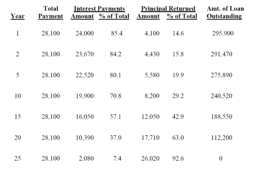

**Interest Payment Amount**: amount of loan outstanding $\times$ 8%

*需要支付的利息，与剩余的要偿还的本金有关*

**Principal Return Amount**: 28100 - interest payment amount

*28100中用于偿还本金的金额*

**Amount of Loan Outstanding**: principal - principal return amount

### 1. Advantages of NPV

- It incorporate the time value of money by discounting.
- It is additive. The present value of the cash flows is simply the sum of the present values of the individual cash flows.
- It uses all the cash flows of the project.

Additional investment evaluative criteria:

1. Payback and Discounted Payback Period (回收期和折现回收期)
2. Internal Rate of Return (IRR, 内部收益率)
3. Profitable Index (盈利指数)

### 2. The Payback Period Method

Definition: **The payback period** is the time it takes to recover the initial investment.

**Payback period rule** is that a particular cutoff date, say, 2
years, is selected. All investment projects that have payback periods of 2 years or less are accepted. The rests are rejected.

Problems:

1. It ignores all cash flows occurring after the project has paid for itself.
2. Arbitrary standard for payback period.
3. Timing of cash flows within the payback period. It ignores the time value of money, since the cash flows are not discounted.

### 3. The Discounted Payback Period Method

We first discount the cash flows. Then we ask how long it takes for the discounted cash flows to equal the initial investment.

**The discounted payback period** of the original investment **is simply the payback period** for these discounted cash flows.

$$
\begin {split}
\text{Paybacks} = \text{Years before full recovery} + 
\\
\frac{\text{Uncoverd cost at the start of the year}}{\text{Cash flow during the year}}
\end {split}
$$

Problems:

1. It ignores all cash flows occurring after the project has paid for itself.
2. Again, how do we decide what the required payback
   period should be?

### 4. The Internal Rate of Return (IRR)

It does not depend on anything except the cash flows of the project.

**It is simply the discount rate that makes NPV equal to zero.**

*我们需要回顾一下，NPV和discount rate的关系式。*

*$NPV = -C_0 + \frac{C_1}{1 + r} + \frac{C_2}{(1 + r)^2} + ... + \frac{C_t}{(1 + r)^t}$*

*通过这个关系式可以求解r，但也意味着要解一个多项式*。

*上市表示的是**lending case或investing case**。它先付出钱。*

*还有**financing case或borrowing case**。它先收入钱，后续逐渐还清。*

*我们可以画出这两种cases的函数图像：*

 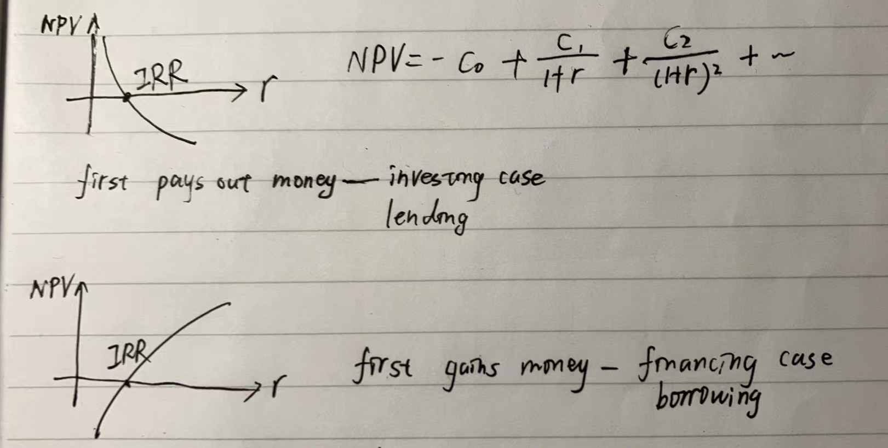

**The Basic IRR Rule** is: Accept the project if the discount rate is below the IRR; Reject the project if the discount rate is above the IRR.

*上面的法则用于lending case。borrowing case则相反。*

Problems:

1. Hard to calculate. The best way to calculate is often trial and error.
2. As above, cases are different in lending and borrowing.
3. Can have multiple IRR, if some dates you gain and some dates you pay.
4. **The Scale Problem (规模问题)** and The **Timing Problem (时间问题)**.

#### (1) The Scale Problem

An **independent project（独立项目）**is one whose acceptance or rejection is independent of the acceptance or rejection of other projects.

If A and B are **mutually exclusive investments (互斥项目）**, then you can accept A or you can accept B, or you can reject both of them, but you cannot accept both of them.

The scale problem is specific to mutually exclusive projects. It is that small project with higher IRR is
preferred to large project with lower IRR but the latter mayhave higher NPV.

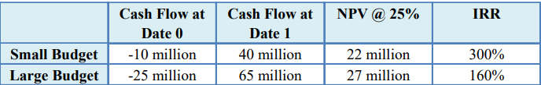

So we use the **incremental IRR**.

If we calculate the incremental cash flows from **choosing the large budget** instead of the small budget, we use **numbers in large budget - numbers in small budget**. Contrary if you choose the small budget:

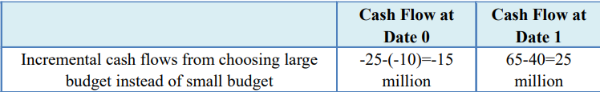

*large - small 对应 lending case; small - large 对应 borrowing case.*

*我觉得incremental IRR是考虑了机会成本*。

#### (4) The Timing Problem

We consider two projects that have the same initial investment. But the pattern of the future cash flows is different.

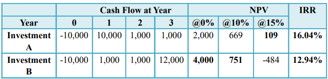

*通过上表可以看出，当折扣率不同时，根据NPV，我们会选择不同的投资方案。如果根据IRR做决策，就会导致错误*。

*我们可以画出两个投资方案NPV的函数图像：*

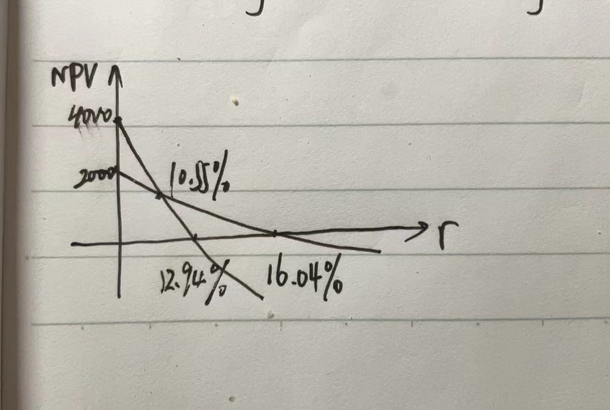

We have three methods:

1. Compare the NPV of the two projects.
2. Compare incremental IRR to discount rate.

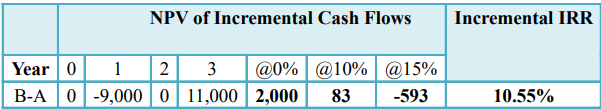

*疑问：我怎么知道是lending还是borrowing case？*

3. Compare the NPV on incremental cash flow.

*如上图所示，当NPV是正的时候（2000和83）说明B方案比A好；是负的时候（-593）说明A方案比B好*

## Lecture 4: Making Capital Investment Decision

date: 2024/9/23

Previous is the basics of capital budgeting; In this chapter, we see some real-world applications.

### 1. Identification of Cash Flows

**Cash flows is not accounting income.**

For example, if I sale something at \$1000 that cost me \$900, but I haven't collected the money. If accounting, we say "sales = \$1000, costs = \$900, profits = \$100"; If being corporate finance, we say "cash inflow = \$0, cash outflow = \$900, profits = \$-900"

*公司金融只看能得到的现金*

**Incremental Cash Flows**: They are the changes in the firm's cash flows that occur as a direct consequence of accepting the project.

Cash flows that should be considered as relevant to a project: 

1. **Opportunity Cost** (机会成本)
   Considered as negative cash flows and subtracted from the NPV of the project.
2. **Side effect** (副效应)
   - Erosion (侵蚀): if a new project reduces cash flows from existing projects.
   - Synergy (协同): if a new project increases cash flows from existing projects.
3. **Taxes** (税收)
   Income before taxes - Taxes = Net Income
4. **Depreciation** (折旧)
   *指资产随时间使用而逐渐减少的价值*
   Subtracted, lowering the final tax bill. This crates a tax shield which is an incremental cash flow.

### 2. Real World Application

Some formulas about **operating cash flow (OCF)**:

$$
\begin {split}
&OCF = Revenues - Expenses - Taxes \\
&Taxes = T_c \times [Revenues - Expenses - Depreciation] \\
\Rightarrow&OCF = (Revenues - Expenses) \times (1 - T_c) + D \times T_c
\end {split}
$$

$D \times T_c$ is **tax shield**.

The method used to compute depreciation expenses is  determined by tax authority.

1. **Straight-line Depreciation** (直线折旧法): $Depreciation\ per\ year = initial\ cost / number\ of\ years$*掌握这个即可*
2. Modified Accelarated Cost Recovery System (加速折旧法): faster depreciation in the first years of an asset’s life and slows depreciation later on, which is beneficial to business from a tax perspective.  

**Salvage Value** (残值) refers to the estimated value of an asset at the end of its useful life.

**Book value** (账面价值) is an accounting concept: $Book\ value\ of\ the\ asset = initial\ cost - accumulated\ depreciation$

If salvage value is not equal to book value, there is tax effect which can be positive or negative.
$$
salvage\ value > book\ value \Rightarrow tax\ due \\
after\ tax\ salvage\ value = salvage\ value - T_c(salvage\ value - book\ value) \\
salvage\ value < book\ value \Rightarrow tax\ credit \\
after\ tax\ salvage\ value = salvage\ value + T_c(book\ value - salvage\ value)
$$
*残值对应的是资产市场上的价格；账面价值顾名思义是账面上的*

## Lecture 5: Risk Analysis, Real Options, and  Capital Budgeting I

date: 2024/9/30

### Succeeding Lecture 4: 3. Inflation and Capital Budgeting

Valuation of long term projects demands an explicit treatment of inflation.  

$r_r$ is real interest rate; $r_n$ is nominal interest rate; $i_e$ is expected inflation rate.

Definition: $(1 + r_n) = (1 + r_r) \times (1 + i_e)$. **A good approximation** is $r_n = r_r + i_e$.

Either use **nominal cash flows** discounted at the **nominal interest rate**, or **real cash flows** discounted at the **real interest rate**.

*补充关于cash flows的inflation：*

$nominal\ cash\ flows = real\ cash\ flow \times (1 + i_e)$

*depreciation属于nominal cash flows*

### Succeeding Lecture 4: 4. Investments of Unequal Lives

Suppose a firm must choose between two machines of unequal lives. Both machines can do the same job, but they have different operating costs and will last for different time periods.  

In this case, if you use present value, you will ignore the fact that you need to buy a new machine sooner in one case than the other.

**Equivalent Annual Cost Method (EAC method)**: It pust costs on a per-year basis. 

1. Calculate the present value of each investment.
2. Use the annuity formula $PV = C \times A^t_r$ to get $C$.
3. Compare $C$.

### 1. Decision Tree

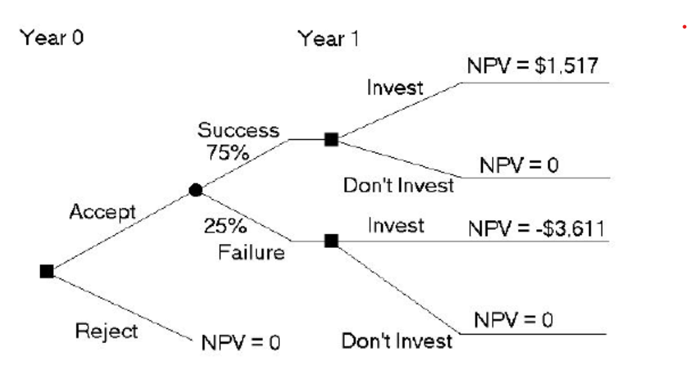 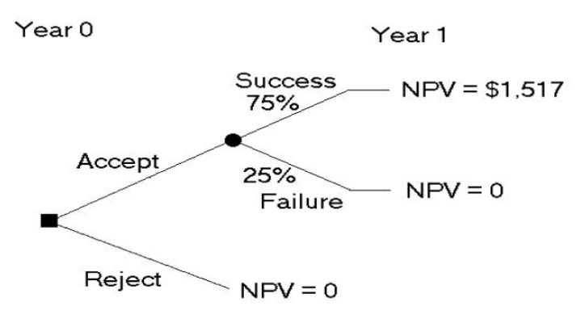 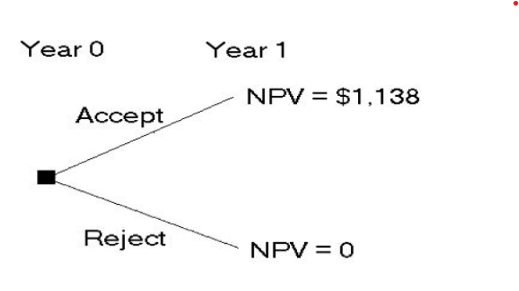

*方形表示人为选择；圆形表示自然选择*

**Backward Induction**: one makes decisions in reverse order with decision trees.

### 2. Sensitivity Analysis

It is the investigation into how net present value varies along with changes in the key factors on which net present value are based.

*有3种情况：**pessimistic, expected and optimistic**.*

**Sensitivity analysis**: One input is variable while the onther inputs are assumed to meet the expectation.

*如何进行分析？*

*先给出各种变量在不同情况下的取值*

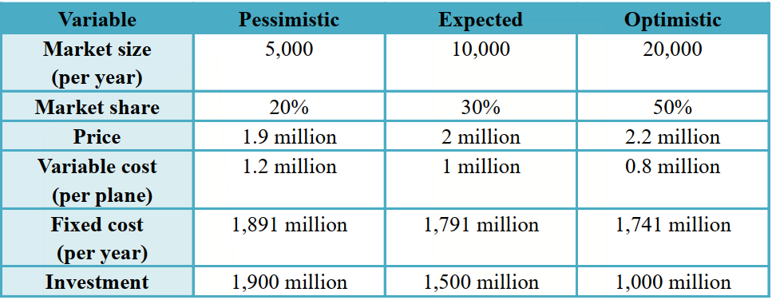

*按照上面的原则，改变一个变量，其他与expected一致，计算NPV*

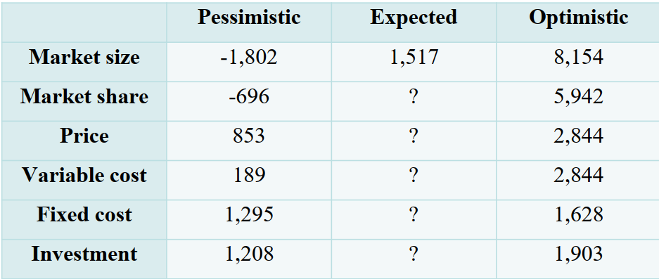

*问号的值为1517，因为这意味着没有变量被改变*

The advantage of sensitivity analysis is that it shows where more information is needed. But sensitivity analysis treats each variable in isolation when, in reality, the different variables are likely to be related.

## Lecture 6: Risk Analysis, Real Options, and  Capital Budgeting II

date: 2024/10/14

### 1. Break-Even analysis (收支平衡分析)

This approach determines the sales needed to break even.

Using the example in "Lecture 5".

Suppose the number of planes is $N$. 
$$
the\ present\ value\ of\ revenues = 2 \times N \times (1 - T_c) \times A^T_r = the\ present\ value\ of\ costs = \\
(1 \times N + 1791) \times (1 - T_c) \times A^T_r - T_cD \times A^T_r + 1500.\\
\Rightarrow N = 2314.44
$$
*两边同除annuity factor，可以得到：*
$$
\frac{EAC + Fixed\ cost \times (1 - T_c) - Depreciation \times T_c}{(Sale\ price - Variable\ cost) \times (1 - T_c)} = N
$$
*这个计算方法更简化，不用计算annuity factor。求解N的步骤可以拆分为：*

1. Turn the initial investment into a T-year EAC.

2. Calculate the numerator which represent the after tax cost.

   *税收有时也能够减少企业的成本，比如这里的fixed cost和tax shield。fixed cost扣除税后才是企业实际负担的成本。*

3. Calculate the denominator. 

   The difference between sales price and variable cost per product is called the **contribution margin** because each additional engine contributes this amount to profit.  

### 2. Real Options

Here are the options about the adjustments that a firm can make after a project is accepted. It can help increase the NPV.

1. The option to expand: learning takes place, and similar ventures are possible

   *learning takes place指的是通过第一波投资你获得了一些市场信息和经验*

2. The option to abandon: projects can be liquidated *清算* or simply stopped.

3. Timing options: decisions about when to make the investment, or decisions can be postponed.

## Lecture 7: Bond Valuation + Valuing Stocks

date: 2024/10/16

*“+”表示两个内容同时在一节课出现*

### Bond Valuation

### 1. Some Terminology about Bond

*债券是这样一种东西：你购买它之后，每年都会获得一笔利息，期满获得本金，这里的本金与利息都是根据面值算出来的，面值并不一定是你购买时的价格。*

Features of bond: 

- It is a certificate showing that a borrower (a firm) owes a specified amount.
- It has a specified payment per period, no risk, also has a specified expiration date.
- The firm must pay interest and principal on bonds, or declare bankrupt.

**Face value/Par value** (面值): the amount of principal loaned. Bonds are usually issued in denominations (面额) of \$1000 or \$ 10000.

**Coupon** (票面利息): specified dollares of interest paid each period, generally six months on the bond.

*也称为annuity component*

**Coupon rate** (票面利息率): the stated annual rate of interest on the bond.

**Maturity** (到期): indicates when the loan will be repaid; ranges from 3 months to 40 years.

*期满偿还的本金也叫做lump sum component*

### 2. Types of Bonds

#### (1) Pure Discount Bonds (纯贴现债券)

also called **zero coupon bonds or zeros (零息债券)**.

It pays no coupons, only face value.

$PV = \frac{F}{(1+r)^T}$.

#### (2) Consols (金边债券)

It pays coupons forever.

$PV = \frac{C}{r}$

#### (3) Level Coupon Bonds (平息债券)

It pays both: coupons every period and the face value at maturity dates.

*平息债券是最常见的情况。多数的市场在30年左右，少数会达到100年。*

$PV = \frac{C}{1+r} + ... + \frac{C}{(1+r)^{T-1}} + \frac{C + F}{(1+r)^T} = C \times A^T_r + \frac{F}{(1+r)^T}$s

### 3. Example of Level Coupon Bonds

Face value is $1,000. Stated annual interest rate is 6%. Coupon rate is 6%. It matures 4 years from now.

If the interest rate unexpectedly falls to 5%, the bond sells at $PV = 1000(6\% \div 2)A^8_{0.025} + \frac{1000}{1.025^8} = 1035.85$. Because \$1035.85 is above \$1000, the bond is said to sell **at a premium**.

If the interest unexpectedly rises to 7%, the bond sells at $PV = 1000(6\% \div 2)A^8_{0.035} + \frac{1000}{1.035^8} = 966.13$. Because \$966.13 is below \$1000, the bond is said to sell **at a discount**.

*实际上就是将债券的名义年利率和市场利率比较，如果前者偏低，则资产缩水。*

### 4. Interest Rate Risk

It is the risk that arises for bond owners from fluctuating interest rates.

All other things being equal, the longer the time to maturity, the greater the interest rate risk; the lower the coupon rate, the greater the interest rate risk.

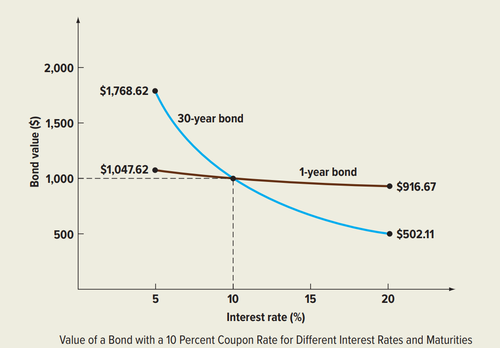

*债券的价值与面值之间的误差是在利息发放的长期过程中产生的，产生原因就是两个rate之间的差异。时间越长，差异就会被放大；至于为什么coupon rate越低，风险越大，就是数学上的问题了，可以从函数图像上看出来：coupon rate越低，对应的斜率越大，即风险越大*

If the interest rate equal to coupon rate, then the current value of the bond equal to its face value. Illustration: $PV = 1000 \times r \times A^8_r + \frac{1000}{(1+r)^8} = 1000 \times r \times \frac{1}{r}[1 - \frac{1}{(1 + r)^8}] + \frac{1000}{(1 + r)^8} = 1000$

### 5. Yield to Maturity (到期收益率)

**YTM** is the discount rate (or interest rate) that equates the price of the bond with the present value of the future cash flow.

A discount bond, with face value of \$1000, currently selling for $950, with a maturity of 10 years and a 7% coupon, paid semi-annually

Here we say "\$950" is the price of the bond. 

$950 = 1000 \times (7\% \div 2) \times A^{20}_r + \frac{1000}{(1 + r)^{20}}$, we solve $r = 3.86\%$. it is the YTM.

> **Semiannual Coupons** In practice, bonds issued in the United States usually make coupon payments twice a year. So, if an ordinary bond has a coupon rate of 14 percent, the owner will receive a total of \$140 per year, but this \$140 will come in two payments of \$70 each.
>
> Suppose the yield to maturity on our bond is quoted at 16 percent. Bond yields are quoted as annual percentage rates (APRs); the quoted rate is equal to the actual rate per period multiplied by the number of periods. With a 16 percent quoted yield and semiannual payments, the true yield is 8 percent per six months.   

*不足一年的都以最小周期单位来进行计算，coupon rate和interest rate都要除以相应的数。如7年的semiannual coupons就按照14年和二分之一rate来算*。

### Valuing Stocks

### 6. Dividend Discount Model (股利贴现模型)

A stock provides two kinds of cash flows. First, most stocks pay dividends on a regular basis. Second, the stockholder receives the sale price when she sells the stock. $P_0 = \frac{Div_0}{1 + r} + \frac{P_1}{1 + r}$, $Div$ and $P$ respectively represent dividend and price.
$$
r = \frac{Div_1}{P_0} + \frac{P_1 - P_0}{P_0}
$$
Stock Return = Dividend Yield (股利收益率) + Captital Gain (资本利得收益率)

We know $P_1 = \frac{Div_1}{1 + r} + \frac{P_2}{1 + r}$, so $P_0 = \frac{Div_0}{1 + r} + \frac{Div_1}{(1 + r)^2} + \frac{P_2}{(1 + r)^2}$, and so on, we get:
$$
P_0 = \sum^{\infin}_{t = 1} \frac{Div_t}{(1 + r)^t}
$$

#### (1) Zero Growth

The dividend is constant forever. $Div_1 = Div_2 = ...$
$$
P_0 = \frac{Div_1}{r}
$$

#### (2) Constant Growth (Dividend Growth Model)

Dividends grow at rate $g$.
$$
P_0 = \frac{Div_1}{r - g}
$$

#### (3) Differential Growth

The dividend is experiencing different growth rate.

### 7. NPVGO Model

If a new investment is made, it must be the case some earnings are not paid out as dividends, but are retained. Retained earnings are invested as capital to generate future earnings.

earnings next year = earnings this year + retained earnings this year $\times$ return on retained earnings.

$g$ = retention ratio $\times$ **return on retained earnings (ROE)**

retention rate = $\frac{retained\ earnings\ this\ year}{earnings\ this\ year}$

discount rate $r = \frac{Div_1}{P_0} + g$.

#### (1) Case 1: Cash Cow (现金牛)

The company pays all of these earnings out to stockholders as dividends.

earning per share (EPS) = dividend per share (DPS)
$$
P_0 = \frac{EPS}{r} = \frac{DPS}{r}
$$

#### (2) Case 2: The firm with growth opportunities

## Lecture 10: Capital Structure I

date: 2024/11/11

The capital structure decision is about how much to be financed by debt and how much to be financed by equity.

### 1. The Pie Theory

**The value of the firm** is the sum of the value of the debt ($B$) and the value of the equity ($S$).
$$
V = B + S
$$

## Lecture 12: Valuation and Capital Budgeting

The goal of this chapter is to value a project, or the firm itself, when leverage is employed.

### 1. Adjusted-Present-Value Approach

$$
APV = NPV + NPVF \tag{1}
$$

$APV$: the value of a project to a levered firm

$NPV$: value of the project to an unlevered firm

$NPVF$: the net present value of the financing side effects.

We consider the following side effects:

1. the tax subsidy to debt
2. the costs of issuing new securities
3. the costs of financial distress (财务困境)
4. some other subsidies to debt financing

So, the formula 1 can be written as
$$
APV = -\text{Initial investment} + \sum^{\infin}_{t = 1} \frac{UCF_t}{(1+r_0)^t} + \text{Additional effects of debt} \tag{2}
$$

### 2. Flow-to-Equity Approach (权益现金流量法)

It means that we discount the cash flow from the project to the equity holders of the leverd firm at the cost of equity capital $r_s$. **LCF**, which stands for levered cash flow, is the residual to equityholders after interest has been deducted.
$$
NPV = \sum^{\infin}_{t=1} \frac{LCF_t}{(1+r_s)^t} - (\text{Initial investment} - \text{Amount borrowed}) \tag{3}
$$
*这个方法只关注流向股东的钱，括号中的内容可以认为是股东们的initial investment。*

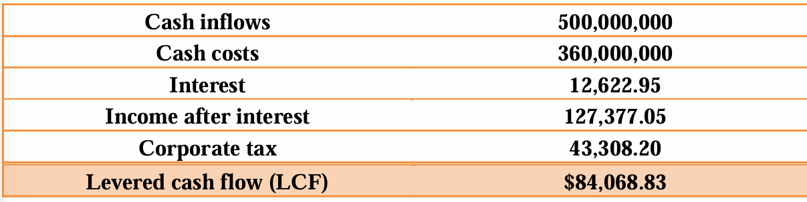
$$
\begin{align}
LCF &= \text{Cash inflows} - \text{Cash costs} - \text{Interest} - \text{Corporate tax}\\ &= \text{Income after interest} - \text{Corporate tax}\\ &= \text{Income after interest} \times (1 - T_c)
\end{align} \tag{4}
$$
We can also calculate levered cash flow directly from unleverd cash flow. The difference between them is the **after tax interest payment**.
$$
UCF - LCF = (1-T_c)r_BB \tag{5}
$$
We can calculate $r_s$ by MM propositon II, $r_s = r_0 + \frac{B}{S} \times (1-T_c) \times (r_0 - r_B)$

The result of this method should be **identical with** the result of APV approach.

### 3. Weighted Average Cost of Capital Method (加权平均资本成本法)

In this method, we discount the unlevered cash flow of the project at the weighted average cost of capital $r_{wacc}$.
$$
NPV = \sum^{\infin}_{t = 1} \frac{UCF_t}{(1+r_{wacc})^t} - \text{Initial investment} \tag{6}
$$
$$r_{wacc} = \frac{S}{B+S}r_s+\frac{B}{B+S}r_B(1-T_c)$$

The result of this method should also be **identical with** the result of APV approach.

### 4. Examples of APV

*除了有一定难度和代表性的例题，其他的题目仅选取一些重要知识点。*

- “The cash revenues <u>less cash expenses</u> (*不包括成本*) per year are $3,500,000.”

- **Flotation costs** are fees paid when stock or debt is issued. These fees may go to printer, lawyers and investment banker, among others.

  "Bicksler Enterprises can obtain a five years loan for $7,500,000 after flotation costs""Bicksler enterprises is informed that flotation costs will be 1 percent of the gross proceeds of its loan."

  $$\text{Gross Proceeds}=\$7,500,000 \div 0.99 = \$7,575,758$$

  $$\text{Flotation Costs}=\$7,575,758\times1\%=\$75,758$$

  The flotation costs are **paid immediately** but are **deducted from  taxes by amortizing** on a straight line basis over the life of the loan.

  $$NPV(\text{Flotation Costs})=-75,758+0.34\times\frac{75,758}{5}\times A_{0.1}^5=-56,228$$

  *类似于税盾*

  Interest must be paid **on the gross proceeds of the loan**, even  though intermediaries receive the flotation costs.

- **nonamoritzing**: the loan will be paid at the end. Or one ballon payment.

  $$NPV(\text{loan})=7,575,758-500,000\times A_{0.1}^5-\frac{7,575,578}{1.1^5}=976,415$$

  *500,000是利息，债的成本（the cost of debt）用risk free return，即0.1。*

#### Example 3:

The initial investment in paving equipment is ==$20 million==. The  equipment will be fully depreciated using the straight-line method over its economic life of ==five years==. Earnings before interest, taxes, and depreciation collected from  the toll road are projected to be ==$3 million== per annum for ==20 years== starting from the end of the first year. The corporate tax rate is ==25 percent==. The required rate of return  for the project under all-equity financing is ==12 percent==. The  pre-tax cost of debt for the joint partnership is ==9 percent== per annum. The U.S. government will subsidize the project with a ==$10 million==, ==15-year== loan at an interest rate of ==5 percent== per year.  All principal will be repaid in one balloon payment at the end  of ==year 15==. What is the APV of this project?

$$\text{Tax Shield}=(20m\div 5)\times 25\%=1m$$

$$NPV = -20m + 3m(1-25\%)A_{0.12}^{20}+1mA_{0.12}^{20}$$

$$NPVF = 10m - 10m\times(1-25\%)\times5\%\times A_{0.09}^{15}-\frac{10m}{1.09^{15}}$$

### 5. How to choose methods

Use WACC or FTE if the firm's target debt to value ratio applies to the project over its life.

Use APV if the project's level of debt is known over the life of the project.

### 6. Capital Budgeting When the Discount Rate Must Be Estimated

*这里的discount rate指的就是$r_s$。下面是可能用到的两个公式：*
$$
r_s = r_f + \beta \times (R_m-r_f) \tag{7}
$$

$$
r_s = r_0 + \frac{B}{S}\times(1-T_c)\times(r_0-r_B) \tag{8}
$$

*$\beta$由于各公司的debt to value ratio等因素不同，也有所不同，是各个公司独有的。$r_0$是作为all equity公司的cost of equity是行业内公司共享的。*

*两家公司中，如果某一家公司的信息包含了$\beta$，可以先用式7求出该公司的$r_s$，然后用式8反求出$r_0$，最后由于$r_0$是共用的，又可以由式8求出另一家公司的$r_s$。*

### 7. Beta and Leverage

