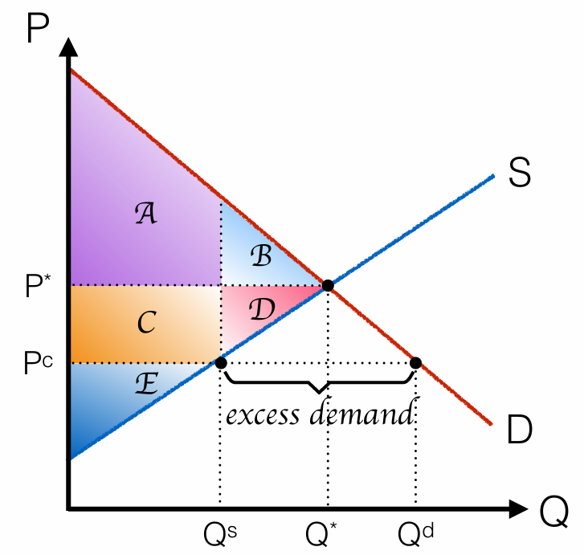
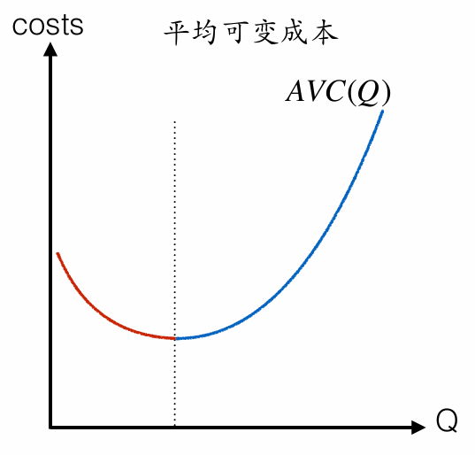

# 经济学原理

## 正课一：经济学基本原理

时间：2024/9/10

### 1. 基本原理

经济学关注三点：社会、互动、理性人。

社会：资源是稀缺的。

- 个体资源稀缺 $\Rightarrow$ 人们面临权衡取舍（trade-off）。
- 总体资源稀缺 $\Rightarrow$ 生产存在边界（production possibility frontier）。

互动

- 人们会对激励（incentives）作出反应。

理性人：

- 最大化自身福利 $\Rightarrow$ 理性人考虑边际（margin）。

### 2. 机会成本

正是由于“人们面临权衡取舍”，才有了“机会成本”这一概念。

某物的**机会成本**是为了得到它而放弃的东西。

- 显性的成本：货币成本（monetary cost）
- 隐形的成本：时间成本（the cost of time）
- **机会成本 = 货币成本 + 时间成本**

### 3. 破窗理论

小孩砸碎理发店的玻璃，商店产生对玻璃的需求，工人有了工作和报酬，促进消费，经济发展。

假设玻璃的成本是200元，砸碎玻璃带来的收益是A元。

- 砸碎玻璃带来的收益是：A元
- 砸碎玻璃带来的显性成本是：200元
- 砸碎玻璃带来的隐性成本至少是：(A - 200) 元 + 一块完整玻璃创造的社会价值

*关注隐性成本的计算过程。A - 200 是砸碎玻璃的净利润，我拿200元去消费也能够创造同样的净利润，甚至还可能有创造更多（这也是为什么隐性成本后面是“至少”），并且收获一个完整的玻璃。玻璃创造的社会价值可以是防止偷盗。*

所以，砸碎玻璃的收益小于机会成本，不应该砸碎玻璃。

### 4. 边际

边际变化是对已有行动计划的小的、增量调整。

理性人考虑最小的增量，通过比较边际上的成本和收益作出最优决策。

局部的最优化会带来整体的最优化。

*上面一条成立的条件是，人的偏好要平滑，不能有某一步收益特别大，这时考虑边际就是错误的。我感觉这有一点计算机算法里贪心的意味。*

离散的情况：最终边际收益 $\geq$ 边际的成本；连续的情况：最终边际收益 = 边际成本

### 5. 生产可能性边界

情境：桃花源里有==10棵树==，每棵树可生产==10只鸡、5杯酒==。

**生产可能性边际**：给定生产技术和要素，可能产出的最大组合。

- 情境中的10棵树就是要素；每棵树能生产的鸡和酒就是生产技术。
- x、y轴上的两个交点分别是只生产酒和鸡的最大产量。
- 斜率一定是负的。因为生产中必然面临权衡取舍。斜率的大小就是生产酒的机会成本。

A点表示不可得；B点表示生产无效率；C、D点表示生产有效率。

生产可能性边界没有告诉我们选择C点还是D点。

如何让A点变得可得？

1. 增加生产要素（树木）。则曲线斜率不变，向右移动。
2. 提高生产技术。一棵树能生产更多的酒，曲线横截距增大。
3. 提高生产技术。一棵树能生产更多的鸡，曲线纵截距增大。

### 6. 沉没成本

指已经付出且无法收回的成本，无论未来的决策如何，这些成本都不会发生改变或被回收。例如，企业在一项项目上已经投入的资金和时间，即使该项目表现不佳，已投入的成本也无法回收，这些投入就是沉默成本。

一个常见的心理误区是“沉没成本谬误”，即人们因为已经投入大量资源而不愿放弃失败的项目或决策，导致继续投入更多资源。然而，从理性的角度来看，**未来的决策应该基于未来的成本和收益，而不是过去的投入**。

## 正课二：双赢的贸易

时间：2024/9/13

显示性偏好：消费者的购买行为暴露或显示了其内在的偏好倾向。

情境：有源主和渔人两个人，鸡和酒两种产品，每人每天有10小时，生产能力如下：

若厂商在生产一单位产品投入的要素较少，那么它在生产该产品时具有**绝对优势**（absolute advantage）。

厂商可能对其生产的所有产品有绝对优势。

自给自足（Autarky）的结果：

我们给两个人添加偏好，源主一定要==50只鸡==，渔人一定要==10杯酒==。此时，源主能得到==25杯酒==，渔人能得到==40只鸡==。

联合生产的结果：

两个人进行分工，然后互相满足对方的基本需求。源主每天==8小时产酒==，==2小时产鸡==；渔人每天==10个小时产鸡==；渔人用==40只鸡==换源主的==15杯酒==。

双方都获得了更多的东西。

*数据设置的原则就是使得每个人的某一个产品数量不变，然后可以观察到另一个产品数量的增加。*

思考两个人共同生产最多可以生产多少鸡和酒？

我们需要确定联合生产可能性边界，但是这个边界并不能通过将x、y轴上两点一连得到。我们要明确生产可能性边界的定义——“最大组合”，所以我们要找到有效的联合生产方法——**对于任意给定数量的商品（如酒），让生产该商品机会成本低的人（如源主）先生产**。

若厂商生产一单位商品的机会成本较小，那么他在生产该种产品时具有**比较优势**（comparative advantage）。

厂商不可能对其生产的所有产品都有比较优势。

*因为一个商品的机会成本是另一个商品机会成本的倒数，$a > b$ 一定有 $\frac{1}{a} < \frac{1}{b}$。*

从而我们画出联合生产可能性边界：

拐点左侧的直线斜率为-2，右侧直线斜率为-4，分别对应了源主、渔人的产酒机会成本。这是因为，拐点前渔人全力产鸡，源主需要在鸡和酒之间做取舍；拐点后，源主全力生产，渔人参与进来，变成渔人要在鸡和酒之间做取舍。

**机会成本的差别为人们从贸易中受益创造了条件。**

如果两人独立生产，但允许贸易，是否能实现联合生产的效果？换而言之，贸易能否促进专业化？

情境补充：集市上，==1杯酒能换回3只鸡==。

源主是否会选择贸易？她该如何组织生产？

**消费可能性边界**（consumption possibility frontier）：消费者可能消费的最大组合。

*蓝色虚线我且称之为消费可能性曲线，它的斜率是酒的市场价格，它的位置则由生产情况，具体而言，由生产可能性边界上的点决定。对于源主而言，全部生产酒时能消费的组合最大，这时就是消费可能性边界。对于其他人，位置可能不同，这由他的生产可能性边界斜率（机会成本）决定。*

*在没有交易的情况下，所产即所得，生产可能性边界就代表了一个人能获得的最大组合。有了贸易，我们就需要看消费可能性边界了。*

二人经济中，为了使贸易发生，**交易的价格应该在两者的机会成本之间**。

如果酒驾过低（比如小于两只鸡），那么经济中每个人在交易前都会生产鸡，然后换酒，然而市场上一杯酒都没有。

**李嘉图模型**告诉我们：

1. 当每个人更多地生产具有比较优势的产品时，经济总量将会增加。
2. 给定市场价格，基于自身利益的考虑，人们会调整各自的生产计划。
3. 基于个体利益最大化的生产却实现了联合生产的效果。
4. 生产完成后，人们根据市场价格自愿地进行贸易，消费原先各自生产可能性边界无法企及的消费组合。

## 正课三：需求和供给

时间：2024年9月24日

### 1. 需求

需求量：在**给定价格**下，买者**愿意且能够**购买的商品数量。

需求：消费者在各个可能的价格下愿意而且能够购买的商品数量。

*需求量是数，需求是函数或曲线。*

**需求定律**：其他条件不变，价格上升导致需求量下降

市场需求是个人需求的总和，即个人需求在每一价格下的**水平加总**。

*图像意义下*

*数学意义下，要取反函数再相加*

需求量的变化由产品价格变动引起，沿着需求曲线移动。

需求的变化由该产品价格以外的因素引起，整条曲线发生移动：向外或向里。这些因素有收入、相关品的价格、预期、买者的数量。

考察一下上述因素对曲线的影响：

- 消费者收入

  - 产品需求随着收入的增加而增加，该产品为**正常品**（normal good）。
  - 产品需求随着收入的增加而减少，该产品为**低档品**（inferior good）。

  
- 相关产品的价格

  - 产品的需求随着另一种产品价格的增加而增加，那么两种产品为**替代品**（substitutes）。
  - 产品的需求随着另一种产品价格的增加而减少，那么两种产品为**互补品**（complements）。

### 2. 供给

供给量：在**给定价格**下卖者**愿意且能够**出售的商品数量。

供给：生产者在各个可能的价格下愿意且能够出售的商品数量。

**供给定律**：其他条件不变，价格上升导致供给量上升。

市场供给是个人供给在给定价格下的水平加总。

供给量的变化由产品价格变动引起，沿着需求曲线移动。

需求的变化由该产品价格以外的因素引起，整条曲线发生移动：向外或向里。这些因素有要素价格、技术、预期、卖者的数量

### 3. 均衡分析

将供给和需求图像结合在一起

**均衡价格**是使得供给和需求平衡的价格，即图中的$P^\ast$。也称为**市场出清价格**。这时市场上每个人都得到满足。

**均衡数量**是使得供给和需求平衡的数量，即图中的$Q^\ast$。

**供需定理**：自由市场上，任何一种物品价格的调整都会使其供给量和需求量相等。

市场如何使得价格趋向于均衡？

假设当下市场价格为$P_1$，高于$P^\ast$。此时，市场的需求量为$Q_d$，市场的供给量为$Q_s$。供给量小于需求量，市场存在超额需求。无法获得产品的消费者通过涨价来竞争生产者。市场价格有上升的趋势和动力

市场价格低于$P^\ast$的情况同理。

买家之间和卖家之间的**充分竞争**保证了价格机制的正常运作。我们假设，

1. 无人拥有市场势力。即个体不能影响价格。
2. 买卖双方均为价格接收者。
3. 市场中有许多消费者和生产者。
4. 产品完全同质（homogeneous good）。

**比较静态分析**的三个步骤：

1. 确定该事件是移动需求曲线还是供给曲线，抑或两者都移动。
2. 确定曲线移动的方向。
3. 用供需模型说明该事件对均衡价格和数量产生的影响。

### 4. 从边际的角度看供需

随着价格的下降，购买人数上升，支付意愿较高的买家先进入市场，新进入买家的支付意愿被需求曲线上对应的价格所刻画。

**边际收益曲线**：社会多生产一单位产品带来的总效益的变化。

社会总收益的变动（即边际收益）来自边际买家支付意愿的兑现，**需求曲线等于边际收益曲线**。

*不必纠结曲线是向上还是向右移动。需求曲线中向右移动更合理，因为给定价格，收入增加意味着能买到的东西更多。如果从边际收益的角度来理解，向上移动更合理，因为收入增加意味着边际买家的支付意愿提高。*

随着价格的上升，卖家人数上升，生产成本较低的卖家先进入市场，新进入卖家的生产成本被供给曲线上对应的价格所刻画。

**边际成本曲线**：社会多生产一单位产品带来的总成本的变化。

边际卖家的生产成本是社会总成本的变动量，**供给曲线等于边际成本曲线**。

## 正课四：弹性

时间：2024年10月8日

情境：颐和园门票是否应该涨价使得总收益更大？

### 1. 弹性的概念

#### 方法一、考虑总量

已知需求曲线为$P = 10 - Q$，则总收益为$Q\times(10 - Q)$ 。

数量从0上升到5，价格从10下降到5，总收益从0上升到25，数量增加的幅度**大于**价格下降的幅度。这时消费者对价格是**敏感**的，即需求**富有弹性**。

数量从5上升到10，价格从5下降到0，总收益从25下降到0，数量增加的幅度**小于**价格下降的幅度。这时消费者对价格是**不敏感**的，我们说需求是**缺乏弹性**的。

#### 方法二、考虑边际

数学知识，当$x$和$y$足够小时，$(1 + x) \times (1 + y) = 1 + x + y$。

给A点微小的扰动，价格下降$\Delta p$，数量增加$\Delta q$。

变动之后的总收益：

$$
\begin {split}
&(P - \Delta p) \times (Q + \Delta q)\\
&= P \times (1 - \frac{\Delta p}{P}) \times Q \times (1 - \frac{\Delta q}{Q})\\
&= (P \times Q) \times (1 - \frac{\Delta p}{P} + \frac{\Delta q}{Q})
\end {split}
$$

$\frac{\Delta p}{P}$和$\frac{\Delta q}{Q}$分别代表价格减少和数量增加的百分比。所以，总收益的变动取决于这两个百分比的大小。如果前者大，则总收益减少；如果后者大，则总收益增加。

**需求价格弹性计算公式**：$E_D = \lvert \frac{\Delta q / Q}{\Delta p / P} \rvert$，即需求量变动百分数比价格变动百分数。

当$E_D > 1$时，对应点处的需求富有弹性，应该降价（总收益增加），不应该提价（总收益减少）；当$E_D < 1$时，对应点处的需求缺乏弹性，应该提价，不应该降价。

*有两点值得注意。一，弹性定义为数量比价格是为了与使得数与表述的变化方向对应。二，上面弹性的计算算的是点的弹性，因为我们令变动量足够小。*

如果我们求一段的弹性会面临什么问题？

1. 因为百分比基准不同，A到B的弹性不等于B到A的弹性。
2. $E_{AB}$和$E_{BA}$不能和1进行比较。

*前面之所以与“1”比较，是因为弹性为1时边际效益为0，总收益达到最大值，而这有赖于变化量无穷小，这样我们才能忽略交叉项$\frac{\Delta p}{P} \times \frac{\Delta q}{Q}$。*

所以我们使用**中点法**来避免这两个问题：$E_{AB} = E_{BA} = \frac{(Q_B - Q_A) / [(Q_A + Q_B) / 2]}{(P_B - P_A) / [(P_A + P_B) / 2]}$

### 2. 弹性和斜率

需求曲线的斜率恒定不变，但需求的弹性却不断变化。**弹性不等于斜率。**

$\text{斜率} = \Delta p / \Delta q$，$\text{弹性} = (P/Q) \times (\Delta q / \Delta p) = (P/Q) \times \text{斜率}^{-1}$。

**给定一点，通过该点的曲线斜率绝对值越小，弹性越大，二者相反。**

1. 完全无弹性的需求。

   

   - $E_D = 0$。消费者完全不因为价格的变动改变自己的消费行为。
   - “老板，我要一斤牛肉。”
2. 完全弹性的需求。

   

   - $E_D = \infty$。当价格高于$P_1$时，消费者需求为零；低于$P_1$时，消费者需求量无穷大；等于$P_1$时，消费者愿意购买任意数量的产品。消费者对价格非常敏感。
   - “老板，我要40块的牛肉。”
3. 单位弹性的需求。

   

   - $E_D = 1$。可以利用左侧等式，解微分方程得出曲线表达式。也可以从概念上理解，弹性为1意味着不管怎么改变价格，总收益都不变，即$P \times Q = C$，所以这是一个反比例函数的曲线。

### 3. 弹性和市场势力

**市场总需求曲线是否等于个体卖家面临的需求曲线？**

**如果市场中只有一个卖家，是的**；如果有许多卖家，不是。

有许多卖家时，个体卖家是价格接受者，一旦它提价，消费者就会离去，所以**个体卖家面临的需求曲线弹性很大。**我们用一条很平坦（无限接近水平）的需求曲线对其进行刻画。但是，整个市场依旧遵循价格定律。

### 4. 需求价格弹性的决定因素

1. 相近替代品的可获得性：相近替代品的个数越多，弹性越大。
2. 必需品还是奢侈品：奢侈品的弹性较大。
3. 时间长短：时间间隔越长，弹性越大。
4. 市场的界定：冰激凌 vs. 香草冰激凌。市场界定越狭隘，弹性越大。

### 5. 其他弹性

#### 供给价格弹性

供给价格弹性是供给量变动的百分数比价格变动的百分数。

完全无弹性的供给和完全弹性的供给，图像上与需求是相同的。

单位弹性供给：

是一条过原点的直线。以上两条都是单位弹性供给曲线。

$E_S = \frac{\Delta q}{\Delta p} \times \frac{P}{Q} = 1$，当直线过原点时，$\frac{P}{Q} = \frac{P-0}{Q-0} = \frac{\Delta p}{\Delta q}$，使得弹性为1。

#### 需求收入弹性

需求收入弹性是供给量变动的百分数比收入变动的百分数。不加绝对值，因为正负号有意义。

小于0，低档品；大于0，正常品。

正常品中，小于1，必需品；大于1，奢侈品。

#### 需求交叉弹性

需求交叉弹性是一个商品需求量变动的百分数比另一个商品需求量变动的百分数。不加绝对值。

小于0，二者为替代品；大于0，二者为互补品。

## 正课五：市场与政策

时间：2024年10月15日

### 1. 价格控制

有**价格上限**（Price Ceiling）和**价格下限**（Price Floor）。

#### (1) 价格上限

*平衡点在价格线的上方，线以上为禁区，所以价格最高卡在$P_c$*

- 在价格上限，需求量大于供给量
- 价格上限导致了过度需求。
- 价格上限限制了需求方的价格竞争。

*价格的上升是消费者导致的，也就是求大于供时*

只有在价格高于价格上限时，政策才会对市场产生作用。

*均衡价格**高于高的，低于低的**，才有效*

价格上限导致配给（rationing）：排队、走后门、卖者对买者的歧视、抽签、票证等

#### (2) 案例：原油禁运

背景：OPEC减少原油产量，美国政府为了应对油价上涨设置价格上限。

市场上存在超额需求，加油站门口排起长队。

#### (3) 案例：租房控制

短期影响：

*如何看待房东和租客的弹性？比如面对突然上涨的价格，租客可以立刻选择条件更差的房子；但是对于房东而言，他们无法立刻买房然后出租。*

租房控制会带来一定程度的短缺。

长期影响：

在长期中，供给和需求较短期更加具有弹性。供给方不再新建公寓、不再出租（改作其他用途或给家人住）；需求方会更积极地涌入城市、选择租房而不买房。

短缺更加严重。

长期租房控制中的无效率：非价格的配给机制（漫长的等待时间，租给没有孩子的房客）、房东无心维持公寓良好条件。

#### (4) 价格下限

- 在价格下限，供给量大于需求量
- 价格下限导致了过度供给
- 价格下限限制了供给方的价格竞争

#### (5) 案例：最低工资

*在最低工资的案例中，需求方是企业，供给方是消费者*

蓝领的劳动力市场：

供给量大于需求量，造成失业。

白领的劳动力市场：

对于白领无影响。

#### (6) 对价格控制的评价

当决策者强制确定市场价格时，他们就模糊了正常指引社会资源配置的信号。

价格控制往往伤害了它想要帮助的人。

- 原先支付意愿较低的消费者被**挤出**市场。
- **黑市**的存在有助于恢复产品的真实价格，但与此同时也提高了产品的交易成本。
- 价格控制对市场提供了负面的激励，在**长期**造成了无效率。

### 2. 数量控制

当管制数量大于均衡数量时，数量管制不起作用。

*大于大的，小于小的*

当管制数量小于均衡数量时，数量管制会对市场产生作用。此时，消费者最后一单位的支付意愿高于最后一单位的生产成本。

此时的商品价格就是$P_H$。

### 3. 税收与补贴

#### (1) 对卖者和买者征税

假设政府对卖家每单位征收==t元==的税收

给定任意数量，卖者每单位生产成本增加了t个单位，即将供给曲线上移t个单位（见左图）

新均衡下市场数量减少，价格上升？

*实际上。供给曲线并没有发生改变，仅仅是一个形式上的变化。所以用的是虚线。*

*原来的均衡点已经没有实际意义，仅仅用于说明征税前后的情况。*

确切地说，是消费者**实际支付的价格上升**（$P^d > P^*$）；生产者**实际收取的价格下降**（$P^s < P^*$)

*税收本质上会使得双方看到的价格不同，此时的平衡条件就是有价差的而非相等的。图像上就好像在供需曲线中打入了一个楔子。*

对买者征税与对卖者征税完全等价（市场价格和市场价格完全一致）（见右图）。

从数学上考虑。如果没有税收，均衡时的情况可以表示为

$$
\begin{equation*}
\begin{cases}
    P^d = D(Q) \\
    P^s = S(Q) \\
    P^d = P^s \equiv P^*\ \text{注：消费者的支出全被支付给生产者}
\end{cases}
\end{equation*}
$$

联立可以解出$Q$，由$Q$解出$P^d$和$P^s$，而这种情况下两个价格相等。

如果有税收，不论对买者还是卖者征税，价格的关系都是$P^d - P^s = t$。

$$
\begin{equation*}
\begin{cases}
    P^d = D(Q) \\
    P^s = S(Q) \\
    P^d - P^s = t\ \text{注：政府作为中间商赚差价}
\end{cases}
\end{equation*}
$$

联立可以解出$Q$，由$Q$解出$P^d$和$P^s$，而这种情况下两个价格不等。

#### (2) 税收的影响

税收抑制市场活动，是对市场的**负面激励**。当一个商品被征税时，市场数量**减少**。

买卖双方都要承担税赋。

#### (3) 税收负担

消费者的税收负担为蓝色区域$：(P^d - P^*) \times Q^{**}$；生产者的税收负担为粉色区域$：(P^* - P^s) \times Q^{**}$；政府的税收收入为粉色区域$：(P^d - P^s) \times Q^{**}$。

 

税收负担更多落在市场中**缺乏弹性**的一方。政府无法决定税收在双方间的真实负担。

弹性衡量卖者和买者根据市场价格变动调整自身行为的能力。当征税是，弹性更小的一方不能轻易离开市场，因此承担更多的税收负担。

#### (4) 补贴

和税收的分析是相同的。

图像上，图线移动方向与税收相反；数学上，$P^s - P^d = t$。

## 正课六：市场效率

时间：2024年10月29日

### 1. 消费者剩余

**消费者剩余**：买者支付意愿减去支付价格。它衡量买者从购买一件商品中感觉到的收益。

需求线以下和价格线以上的区域衡量了市场上（总）的消费者剩余。

给定任一数量，需求曲线与价格之间的高度是边际买家的消费者剩余。

降价带来的影响分为三方面：

1. 原来在市场里的人变好了，对应B。
2. 有新的消费者进入市场，对应C。
3. 有一些人既没变好也没变坏。

新的消费者剩余：A + B + C。

### 2. 生产者剩余

**生产者剩余**：出售一种商品得到的金额减去生产的成本。它衡量了经济中卖者得到的收益。

价格线以下和需求线以上的区域衡量了市场上（总）的生产者剩余。

给定任一数量，价格与供给曲线之间的高度是边际卖家的消费者剩余。

分析同上。

### 3. 对均衡的福利分析

社会总剩余 = 消费者总剩余 + 生产者总剩余 = 消费者总支付意愿 - 生产者总生产成本

当产量等于**均衡产量**时，最后一单位买者的支付意愿等于边际卖者的支付成本，**社会总剩余最大化**。

 

自由市场把生产分配给生产成本最低的卖者，把消费分配给支付意愿最高的买者。价格机制导致的激烈竞争使得最后一单位产品的生产成本等于其价格，从而达到了总量的社会最优。

效率的标准：

1. **配置效率**：最大化社会总剩余
2. **帕累托效率**：资源配置中不存在帕累托改进
   * **帕累托改进**：假定固有一群人和可分配的资源，在从一种状态到另一种状态的过程中，在所有人的情况不会变坏的前提下，使得至少一个人情况改善。

社会总剩余最大化 $\Leftrightarrow$ 经济中不存在帕累托改进

上述等价背后的假设：

- 不考虑公平，只考虑效率
- 完全竞争，无市场势力
- 市场结果只和买家、卖家有关（无外部性）

**数量才是判断一个市场是否有效的关键。效率（福利）的损失来源于数量的偏移**

### 4. 对政策的福利分析

#### (1) 价格上限

|                      | 无价格上限        | 有价格上限 | 变化   |
| -------------------- | ----------------- | ---------- | ------ |
| **消费者剩余** | A + B             | A + C      | C - B  |
| **生产者剩余** | C + D + E         | E          | -C - D |
| **总剩余**     | A + B + C + D + E | A + C + E  | -B - D |

*这是一种极为理想的情况，我们认为仍然是支付意愿最低的那部分人被排除出市场。这样造成的总剩余的损失是现实情况中的最小值。*

#### (2) 税收

|                | 征税前                | 征税后        | 变化   |
| -------------- | --------------------- | ------------- | ------ |
| **消费者剩余** | A + B + C             | A             | -B - C |
| **生产者剩余** | D + E + F             | F             | -D - E |
| **政府税收**   | 0                     | B + D         | B + D  |
| **总剩余**     | A + B + C + D + E + F | A + B + D + F | -C - E |

税收不能等同于转移支付。税收对买卖双方造成的损失大于政府通过征税获得的收入，给经济带来了**无谓损失**。

但如果有一方完全无弹性时，税收就是转移支付。因为这时的交易量不会偏离均衡数量，所以不会有无谓损失。

无谓损失的决定因素：

- 税收规模

  - **税收规模越大，无谓损失越大**，且增大速率加快。

    

  - 政府的税收收入随着规模的增加先增后减——**拉弗曲线**

 

- 供需双方的价格弹性。
  - 固定一方不变，另一方**价格弹性减小，无谓损失减少**，直到完全无弹性时，没有无谓损失。

## 正课七：外部性及公共品

时间：2024年11月12日

### 1. 市场失灵与外部性

**市场失灵**：不完全竞争市场下，由于各种原因无法实现资源的最优配置

完全竞争市场：大量卖家、产品同质、信息对称、资源流动性（产权明晰）

当市场结果影响到市场以外的其他人时，价格所反映的买者支付意愿和卖者成本就不再是整个社会的收益和成本。

在竞争性市场中，**市场失灵的一个原因是外部性**。另外还有信息不对称、博弈。

**外部性**：个体经济单位的行为对社会或者其他部门造成了影响却没有承担相应的义务获得回报。

外部性引起市场无效率，因此不能使总剩余最大化。

外部性分类：正外部性、负外部性。

厂商和消费者眼中的成本和收益：私人成本、私人收益。

社会计划者眼中的成本和收益：社会成本、社会收益。

*引入外部性之前，市场（私人）等于社会；引入外部性之后，市场和社会就不等同了。*

### 2. 负外部性

假设每一单位钢铁的生产对社会造成污染的成本是10元。

对于社会计划者来说，生产钢铁的社会成本包含两部分。

- 企业生产所需成本（企业考虑）
- 污染造成的社会成本（企业未考虑）

$Q^*$是市场最优，$Q^{eff}$是社会最优。

*研究市场结果，我们看私人曲线；研究社会结果，我们看社会曲线。*

负外部性使得**均衡产量高于社会最优产量**，造成生产过剩。

$SMC(Q) = PMC(Q) + EXT(Q)$

- $SMC(Q)$：社会边际成本。
- $PMC(Q)$：私人边际成本。
- $EXT(Q)$：外部边际成本，最后一单位产品的生产给社会带来的厂商和消费者都没考虑的成本。

上面的图中，每一单位产品产生的负外部性相同；也存在负外部性不相同的情况。

**负外部性下的无谓损失**：

方法一：计算无谓损失时，只需看社会边际成本曲线和社会边际需求曲线。

方法二：福利分析。

- 最大化社会总剩余：$TS_{max} = A + B$

- 均衡下的社会总剩余：$TS$

  - 均衡下的消费则剩余：$CS = A + C$
  - 均衡下的生产者剩余：$PS = B + D$
  - 均衡下的负外部性：$EXT = D + C + E$

  $TS = CS + PS - EXT = A + B - E$

- 无谓损失：$DWL = TS_{max} - TS = E$

### 3. 矫正负外部性

矫正外部性不是要清除污染，而是要消除无谓损失。

*前面我们知道，无谓损失来源于数量的偏移。所以，我们要采取办法调整数量。*

此时政府在管制负外部性存在时可以改善社会福利。政府能够采取的措施有：

- 教育
- 征税
- 许可证

所有政策的目标都是**内部化外部性**。

#### (1) 税收

为了使市场数量下降到社会最优产量，政府可以对市场进行征税。这类税叫做矫正税或庇古税。

如果税收**等于最优产量下的边际外部成本**，那么征税后的市场是有效率的。

 

- 最大化社会总剩余：$TS_{max} = A + B$

- 均衡下的社会总剩余：$TS$

  - 均衡下的消费则剩余：$CS = A$
  - 均衡下的生产者剩余：$PS = D$
  - 均衡下的负外部性：$EXT = D + C$
  - 均衡下的政府收入：$GR = B + C$

  $TS = CS + PS + GR - EXT = A + B$

- 无谓损失：$DWL = TS_{max} - TS = 0$

#### (2) 可交易的许可证

*许可证是一种数量控制。*

不可交易的许可证：由于政府无法判断每家企业的生产成本，矫正反而产生新的无谓损失

可交易的许可证：会形成一个新的市场——许可证市场。模型之内，生产成本更高的企业愿意将许可证卖给生产成本更低的企业。模型之外，许可证给企业提供改善生产技术的激励。

*一个通俗的解释：假设一张许可证的价格在100w上下，生产成本高的企业利润少，不足以抵消许可证的成本，它就不会去购买，或者它认为卖出许可证的获利比拿着许可证生产的利润高。对于购买了许可证的企业，它一定是盈利的，但是它会希望通过改善技术降低成本，尽快回本，获取更多利润。*

#### (3) 税收和许可证的对比

我们将污染看作一种商品，为了实现生产，企业本质上存在对污染的需求。

如果政府采用庇古税来矫正市场的负外部性，庇古税就是企业对污染所支付的价格，庇古税和需求曲线共同决定了污染的数量。

如果政府采用可交易许可证来矫正市场的负外部性，许可证的交易价格就是企业对污染所支付的价格，政府直接规定了市场上污染的供给（完全无弹性），污染的供给和需求曲线共同决定了污染的价格。

市场需求发生波动时，以上两个政策都有可能失效，比如每单位的外部成本不一致的情况。

许可证的数量需要从$Q_1$变成$Q_2$；税收需要从$t_1$变成$t_2$。

#### (4) 无谓损失产生的原因

我们需要找更好的方法来矫正外部性，首先要找到无谓损失产生的原因。

外部性不是无谓损失产生的根本原因。

市场之所以失灵，本质上是因为产权不明晰。

前面的例子中，钢铁的产权是清晰的，而污染的产权不清晰。

**科斯定理**：如果当事各方能就资源配置**无成本（或以较低成本）**地谈判议价，那么私人市场总能自行解决外部性问题，并有效配置资源。

- 简单来说，只要有了产权，人们自然会商议出合理的价格来。
- 例：闰土希望鲁迅安静。鲁迅获得了“安静“的产权，闰土会出价（大于稿费）使鲁迅安静。闰土获得了安静的产权，鲁迅的稿费小于闰土对”安静“的估价，无法收买闰土。

### 4. 正外部性

正外部性的两种画法

正外部性使得市场均衡低于社会的最优数量，所以政府干预市场的目标是增加社会产量。

政府可以通过**补贴**实现，但是不能通过许可证。

### 5. 公共品与共有资源

对于公共品，市场无法发挥作用。

#### (1) 物品的分类

竞争性：某人的使用**减少**他人对物品的享用。

排他性：可以**阻止**其他人享用该商品。

#### (2) 关于效率的讨论

如果产品是**非排他**的，那么一旦产品被生产出来，企业没法阻止其他潜在消费者使用该产品，消费者会拒绝支付，消费者会有搭便车的激励，市场无效率。

如果产品是**非竞争**的，那么只要产品被生产出来，就可以被许多人享用（*例如，广播电视节目制作好后，无论有一个观众还是一百万个观众观看，节目制作方不需要为每个新增的观众再花费额外的制作成本。每增加一个观众不会增加额外的物理资源消耗或额外制作成本*），生产的**边际成本为0**。如果市场存在，则$P>0, P = MB \Rightarrow MB > MC$, 市场是无效率的。

#### (3) 公共品

**公共品**是不具有竞争性也不具有排他性的物品。

#### (4)  公共品 vs. 私人物品

私人物品的边际收益是个人边际收益曲线（需求）在给定价格下的水平加总

**公共品的边际收益是个人边际收益曲线（需求）在给定数量下的垂直加总**

对私人物品而言，每位消费者购买产品后可以防止其他消费者使用该产品，因此该单位产品的消费对社会总收益的增加只来自于一位消费者。

对于公共品而言，无法阻止其他人使用，因此该单位产品的消费对社会总收益的增加来自于享用此物品的所有消费者。

#### (5) 共有资源

**共有资源**是具有竞争性，但不具有排他性的物品。

**共有地悲剧**：当某一消费者使用了共有资源，他就减少了其他人对该物品的享用。当个人使用产品而无需支付费用时，共有资源就容易被过度地使用，从整个社会的角度来看，共有资源的使用将大于社会最优的使用量。 

解决共有地悲剧的方法：

- 数量控制
- 税收
- 可交易的许可证
- 产权私有化

## 正课八：消费者理论

时间：2024年11月19日

### 1. 预算约束线

### 2. 消费者偏好的刻画

#### (1) 无差异曲线

**无差异曲线**：给消费者相同满足度的消费组合。经济学中用无差异曲线来刻画消费者的偏好。

- 在无差异曲线上的任意两种消费组合对于消费者来说是等价的
- 满足度在经济学中被称为**效用**。

#### (2) 无差异曲线的性质

1. 无差异曲线向右下方倾斜

   - 无差异曲线上某一点的斜率的绝对值称为**边际替代率（MRS）**。

2. 较高的无差异曲线对应更高的效应

3. 无差异曲线不相交

4. 无差异曲线凸向原点

   - 边际替代率随着消费量的增加而递减

   - 反例：香烟、酒、毒品、游戏等成瘾类物品

      

5. 两点连线上的点一定偏好于两点（人们喜欢多样性）

### 3. 预测消费者行为

最终的消费组合一定在预算约束线上。根本原因：模型中不允许消费者储蓄

最终的消费组合必定在最高的无差异曲线上。否则消费者可以改变消费组合获得更大效用。

给定产品价格$(P_A, P_B)$，消费者收入$I$和消费者的偏好，在最优的消费组合处：两种产品的边际替代率等于两种商品的相对价格。
$$
MRS = \frac{P_B}{P_A}
$$

### 4. 构建需求曲线

当香蕉价格下降时：

- 消费者感觉比从前更加富有，如果香蕉是一般物品，消费者将购买更多数量的香蕉（收入效应）。
- 香蕉相对于苹果更加便宜，消费者将购买更多数量的香蕉（替代效应）。

### 5. 应用：劳动供给曲线

在劳动力市场，劳动的供给来自消费者，因此我们可以用消费者理论去构建劳动力市场的供给曲线。

为了构建劳动供给，我们考虑的两个商品分别是**收入和闲暇**。

### 6. 应用：利率与储蓄

为了研究人们的储蓄行为，模型应该包括：

- 储蓄的价格（或机会成本），即利率
- 模型背后的机制：人们可以通过储蓄减少当下的消费，从而增加未来的消费。人们面临当下消费和未来消费的权衡取舍。

## 正课九：厂商理论 I

时间：2024年11月26日

### 1. 经济学中的成本和利润

企业的目标：利润最大化

利润 = 总收益 - 总成本

- 总收益：企业出售产品而得到的总金额
  - 假设单一产品，单一价格：总收益 = 产品价格 $\times$ 出售数量
- 总成本：企业为了完成生产所投入的总金额

企业的生产成本 = 显性成本 + 隐性成本

- 显性成本：对生产要素直接的资金支出
- 隐形成本：不涉及直接的资金支出，如企业主的机会成本。

经济利润：总收益 - （显性成本 + 隐性成本）

*完全竞争市场中，企业零利润*

> **新企业进入市场**：在短期内，如果企业获得了利润，吸引其他企业进入市场，因为在完全竞争市场中没有进入障碍。新企业进入市场后，会增加市场的供给量，导致市场价格下降。
>
> **价格下降导致利润减少**：随着新企业的进入，供给增加，市场价格会逐渐下降，直到价格降低到等于企业的平均总成本（$P = ATC$），这时企业的利润就变为零。
>
> **退出市场**：如果企业在短期内遭遇亏损（$P<ATC$），一些企业会退出市场，减少供给，推动市场价格上升，直到价格恢复到等于企业的平均总成本，企业重新达到零利润。

会计利润：总收益 - 显性成本

### 2. 成本曲线

刻画企业的生产（成本函数），我们需要知道

- 生产所需投入的要素价格
- 生产所需的技术：生产函数

#### (1) 生产函数

生产函数：生产某物品所使用的投入的数量和该物品产出的数量之间的关系
$$
Q = f(K, L)
$$
$K$表示资本数量，$L$表示劳动力数量。

为了分析简便，我们假定煎饼的生产只需要投入劳动力$Q = f(L)$。

*可以认为是短期内资本无法改变*

为了研究生产函数，我们引入边际产量。

**边际产量**：生产过程中增加一单位要素投入（劳动力）带来的产量的增量
$$
MP = \frac{\Delta Q}{\Delta L}
$$

某要素投入量的边际产量越大，生产函数越陡峭。

生产函数的基本性质：

- 产量$Q$关于要素数量递增：$f'(L) > 0$
- 生产函数经过原点：$f(0) = 0$

生产函数的形状：

1. 线性
2. 凸
3. 凹

典型的生产函数是先凸后凹的。生产初期，由于资源的有效配置（或团队的有效分工），新增劳动力的产量不断增加；随着产量的不断增加，新增劳动力的边际贡献会不断减少。

#### (2) 总成本函数

**总成本函数**：企业能够生产的数量与成本之间的关系。

**总成本($TC$) = 总固定成本($TFC$) + 总变动成本($TVC$)**

- 固定成本：不随产量改变而改变的成本，如租金
- 可变成本：随着企业产量变化而变化的成本，如工人工资

总成本函数的基本性质：

- 总成本关于产量递增
- 如果生产的固定成本不为零，那么产量为零时的总成本为正。

为了研究总成本曲线的一般形状，我们引入边际成本的概念。

**边际成本**：生产过程中企业增加一单位产量带来的总成本的增量
$$
MC = \frac{\Delta{TC}}{\Delta Q}
$$
典型的边际成本曲线先减后增。对应总成本曲线先凹后凸。

边际产量的变化方向与边际成本相反。

对比生产函数和总成本曲线：

 

#### (3) 平均固定成本

$$
AFC = \frac{TFC}{Q}
$$

由于总固定成本不随产量变化而变化，平均固定成本关于产量递减，是一条反比例函数曲线。

#### (4) 平均可变成本

$$
AVC = \frac{TVC}{Q}
$$

平均可变成本先减后增。生产初期，由于社会分工的好处，边际成本递减，新增产量的成本越来越低，不断拉低平均可变成本；生产后期，由于边际产出递减，边际成本递增，新增产量耗费的成本非常高，最终将拉高平均可变成本成本。

*平均可变成本曲线的**拐点一般晚于**边际成本曲线。因为可能虽然新的边际成本大于最小边际成本，但它依旧小于平均可变成本，这时平均可变成本曲线依旧向下倾斜。*

#### (5) 平均总成本

$$
ATC = \frac{TC}{Q}
$$

平均总成本曲线先减后增。

生产初期，平局可变成本和平均固定成本均降低；生产后期，平均固定成本趋于零，平均可变成本快速上升。

由于平均总成本曲线成U型，因此存在使平均总成本最小化的产量。这一产量（$Q_e$）有时被称作企业的**有效率规模**。

平均总成本曲线在平均可变成本曲线之上，**两条曲线之间的距离为平均固定成本**。因此，随着产量的增加，平均可变成本最终将从下方趋向于平均总成本曲线。

  考试按右图画。

**$MC$曲线交$ATC$和$AVC$曲线于它们的最低点**

- 当$MC < ATC$时， 新增的产量将拉低平均总成本。
- 当$MC > ATC$时，新增的产量将拉高平均总成本。
- 平均可变成本同理。

### 3. 长期成本与短期成本

许多成本在短期内是固定不变的，而在长期内企业是可以改变的。如租金，可以选择租金更低的地方。

所有短期平均总成本曲线都在长期平均总成本曲线或以上。长期平均总成本是比短期平均总成本扁平得多的U型曲线。

企业在长期中有更大的灵活性:

- 长期内，企业可以选择工厂规模；短期内，企业只能在给定工厂规模下生产。一条短期$ATC$曲线本质上代表了企业在一定约束（规模）下的生产技术。
- 给定产量$Q$。短期内，小型工厂的平均总成本大于中型工厂的平均总成本（技术水平、资源配置的差异），长期里企业会相应扩大厂房规模。

### 4. 规模经济与规模不经济

规模经济：长期平均总成本随着产量增加而减少。原因：专业化的分工

规模收益不变：长期平均总成本不随产量变动而变动

规模不经济：长期平均总成本随着产量增加而增加。原因：大型组织的协调问题。
