# 中级微观经济学

PPT为英文，故笔记主要采用英文。注释使用中文。

## 正课一：preference 偏好

日期：2024/9/16

- Suppose there are two goods.

- Let $\mathsf{X} = \mathbb{R}^2_+$ be the consumption space.
  - each point in $\mathsf{X}$ is a pair $(x_1,x_2)$.
    - $x_1$ is the amount of good 1 and $x_2$ is the amount of good 2.
  - $(x_1,x_2)$ is called a consumption bundle.
  - so $\mathsf{X}$ contains all possible consumption bundles.

*pair$(x_1,x_2)$表示人面临两个选择，当选择大于两个时，可以认为$x_1$是某个选择，而$x_2$是其余选择的集合；或者可以认为是人在某一个瞬时只面临多个选择中的两个*

- Ultimately, we want to understand how consumers choose their best consumption bundles from those that are affordable.
  - We must understand how consumers rank consumption bundles as to their desirability.
  - Such a ranking is called **consumer's preference**.
- weak preference (弱偏好)
  - $(x_1,x_2) \succsim (y_1,y_2)$
  - The consumer finds $(x_1,x_2)$ is at least as good as $(y_1,y_2)$.
- indifference (无差异)
  - $(x_1,x_2) \sim (y_1,y_2)$
  - Both $(x_1,x_2) \succsim (y_1,y_2)$ and $(y_1,y_2) \succsim (x_1,x_2)$ hold.
- strict preference (严格偏好)
  - $(x_1,x_2) \succ (y_1,y_2)$
  - $(x_1,x_2) \succsim (y_1,y_2)$ but not $(y_1,y_2) \succsim (x_1,x_2)$.
- These are ordinal relations (序数关系).
  - Only rank alternative bundles by order.
  - Do not specify magnitude of preference difference.
- There are three basic properties that we think a preference relation should have: 
  1. Complete (完备性假设)
     - For any pair of consumption bundles $(x_1,x_2)$ and $(y_1,y_2)$, either $(x_1,x_2) \succsim (y_1,y_2)$ or $(y_1,y_2) \succsim (x_1,x_2)$ or both hold.
     - Any two bundles are comparable.
  2. Reflective (自反性假设)
     - Any bundles is at least as good as itself: $(x_1,x_2) \succsim (x_1,x_2)$.
  3. Transitive (传递性假设)
     - If $(x_1,x_2) \succsim (y_1,y_2)$ and $(y_1,y_2) \succsim (z_1,z_2)$, then $(x_1,x_2) \succsim (z_1,z_2)$.
     - Consumers' preferences are logically consistent.
  
  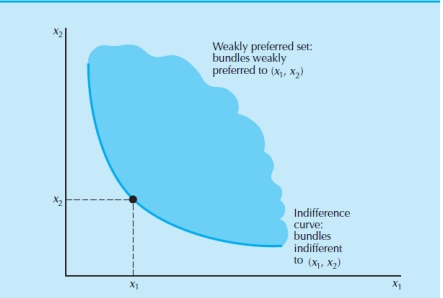

- **Indifference curve** (无差异曲线): the consumer is indifferent between all bundles on that curve.
- Without additional properties on preferences, the inderrerence curves may behave badly. An example:

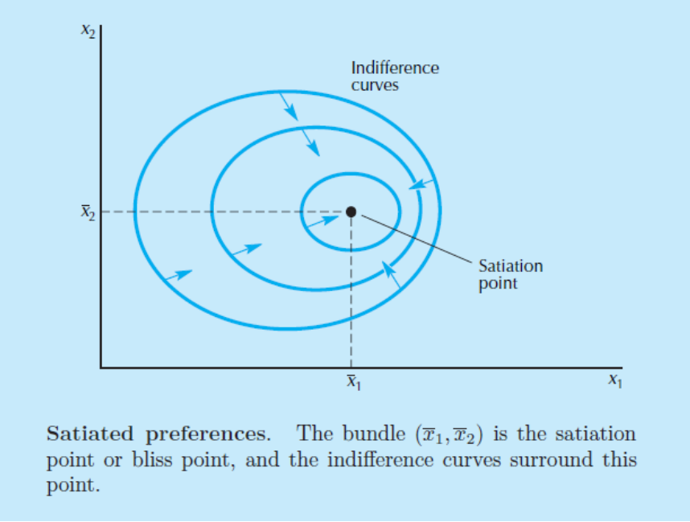

- Additional porperties of preferences:

  1. Monotonicity (单调性)

     - For all bundle $(y_1, y_2)$ such that $y_1 \geq y_2$ and $x_1 \geq x_2$ with at least one inequality being strict, we have $(y_1, y_2) \succ (x_1, x_2)$.

     - In words, more is better

     - It's also called the assumption of non-satiation (非饱和性假设).

     - It implies that: negative slope for each indifference curve; indifference curves are not "thick"; difference curves cannot cross [with transitivity (传递性)].

       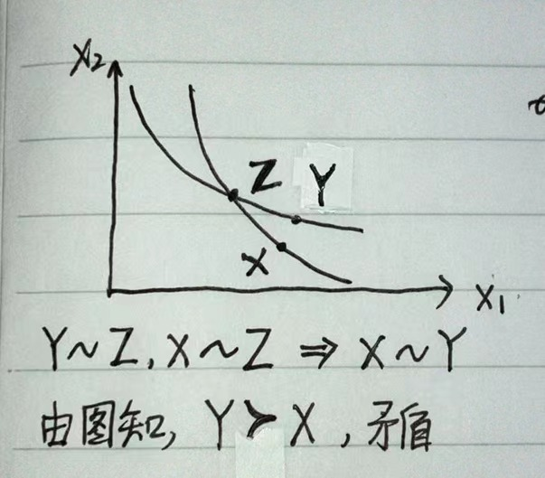

  2. Convexity (凸性)

     - If $(y_1, y_2) \succsim (x_1, x_2)$ and $(z_1, z_2) \succsim (x_1, x_2)$, then $(ty_1 + (1 - t)z_1, ty_2 + (1 - t)z_2) \succsim (x_1, x_2)$, for any $t \subseteq [0, 1]$.

       *这里的$(ty_1 + (1 - t)z_1, ty_2 + (1 - t)z_2)$表示是Y和Z两点连线之间的点。*

     - consumers want to diversify their consumption.

       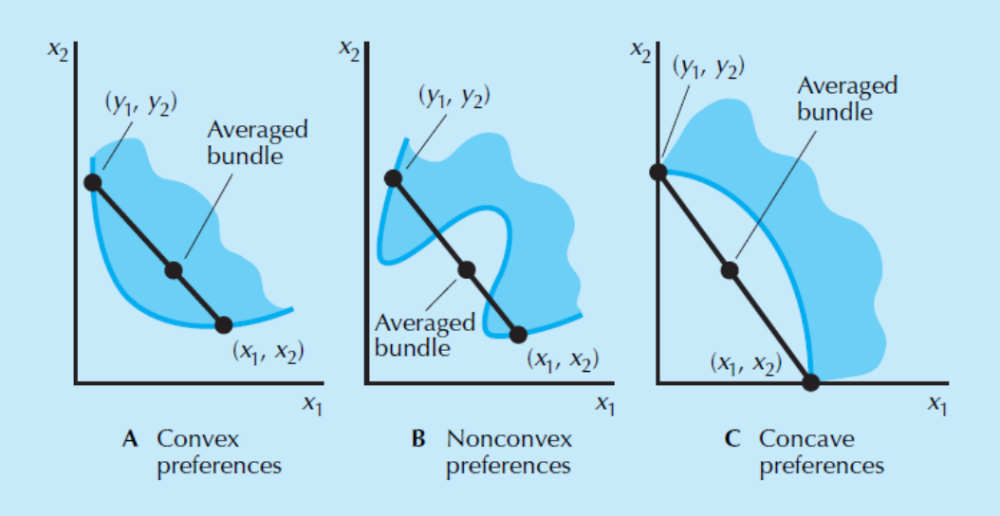

*前面的三个性质是”偏好“这个定义本身的性质，而后两个是用于描述图像的性质。后两个的出现是为了画出更好研究的图像。*

- **Utility function** is a function that measures the level of satisfaciton a consumer receives from any consumption bundle.
  - $(x_1, x_2) \succsim (y_1, y_2)$ if and only if $u(x_1, x_2) \geq u(y_1, y_2)$ 
  - Basic idea: assign a real number to each consumption bundle.
  - $(x_1, x_2) \sim (y_1, y_2) \Leftrightarrow u(x_1, x_2) = u(y_1, y_2)$ $(x_1, x_2) \succ (y_1, y_2) \Leftrightarrow u(x_1, x_2) > u(y_1, y_2)$
- We can express the same preference relations by the different utility functions, each of them ranks the bundles in same way.
- If u represents $\succsim$, then the composite function $v: \mathsf{X} \rightarrow \mathbb{R}$ with $v(x_1, x_2) = f(u(x_1, x_2))$ where $f: \mathbb{R} \rightarrow \mathbb{R}$ is a strictly incresing function, is a utility function that represents the same preference.
- Utility is an ordinal concept.
  - If $u(x_1, x_2) = 6$ and $u(y_1, y_2) = 2$, then $(x_1, x_2) \succ (y_1, y_2)$.
  - But $(x_1, x_2)$ is not preferred three times as much as $(y_1, y_2)$.

- The indifference curve is defined by the implicit function $u(x_1, x_2) = k$
  - If $u(x_1, x_2) = x_1x_2$, a typical indifference curve has the formula: $x_2 = \frac{k}{x_1}$.

- **Cobb-Douglas preferences (科布道格拉斯效用函数)**

  *简称C-D函数。*

  - The utility function is $u(x_1, x_2) = x_1^c x_2^d$, $c$ and $d$ are two positive numbers.
  - This is the most widely used utility form in economics.
  - Other forms：$V_1(x_1, x_2) = clnx_1 + dlnx_2$ or $V_2(x_1, x_2) = x_1^a x_2^{1-a}$.

- Two goods are **perfect substitutes** if the consumer is willing to substitute one good for the other at a constant rate.

- The utility function is $u(x_1, x_2) = ax_1 + bx_2$, $a > 0$ and $b > 0$ measure the "value" of goods 1 and 2 to the consumer.

  - The consumer is willing to substitute $a/b$ units of good 2 for one unit of good 1.

- Indifference curves for perfect complements.

  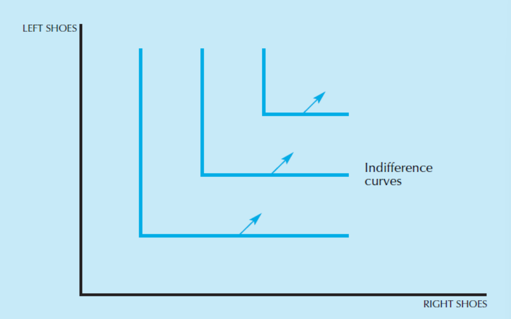

*完全互补品意味着它们必须成对使用，所以可看到，当右边的鞋子数量不变时，增加左侧的鞋子效用函数大小不变。顶点处就是它们恰好成比例地使用时。*

- Marginal utility (边际效用) is the rate at which total utility changes as the level of consumption rises.

- When the utility function $u(x_1, x_2)$ is differentiable (可微), the **marginal utility of good 1** is: 

  $MU_1(x_1, x_2) = \frac{\partial u(x_1, x_2)}{\partial x_1}$

- Similarly, you can get $MU_2$.

- **Marginal rate of substitution** (MRS，边际替代率) is the rate at which the consumer will give up one good to get more of another, holding the level of utility constant.

- The $MRS_{12}$ is the number of $x_2$ the consumer is willing to give up in order to obtain one more unit of $x_1$ at $(x_1, x_2)$.

- Mathematically, it is the "slope" of the consumer's indifference curve at $(x_1, x_2)$.

  $MRS_{12}(x_1, x_2) = \frac{MU_1}{MU_2}$

  *要从定义上区别清边际效用（MU）和边际替代率（MRS）的图像意义和计算公式上的差别。MU是在图线间移动，变量有两个，斜率（或者说变化率）是偏导；而MRS是在图线上移动，一个是自变量，一个是因变量，斜率是导数。对于上面最后一个公式，可以认为$MRS_{12} = \frac{dx_2}{dx_1} = \frac{\partial x_2}{\partial x_1}$。*

## 正课二：Budget Constraint 预算约束

日期：2024/9/21

- When a person is faced with a choice among several possible options, he will choose the one that yields the highest utility (utility maximization).
  - People are constrained in their choices by the size of their incomes and other resources.
- Suppose the price of good 1 is $p_1 > 0$ and the price of good 2 is $p_2 > 0$.
- Suppose the total amount of money that the consumer can spend on goods 1 and 2 is $m$.
  - $m$ is usually called the consumer's income.
- If the consumer can afford the bundle $(x_1, x_2)$, we have $p_1x_1 + p_2x_2 \leq m$ called the consumer's **budget constraint**.
- Budget set (预算约束集):
  - The set of all bundles that are affordable to the consumer.
  - It can be expressed as $\{(x_1, x_2)|p_1x_1 + p_2x_2 \leq m\}$.
- Budget line (预算约束线):
  - The set of all bundles that just exhaust all the consumer's money.
  - $x_2 = \frac{m}{p_2} - \frac{p_1}{p_2}x_1$.

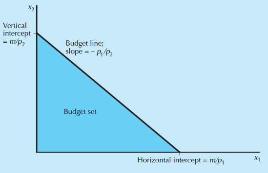

- The budget line intersects the $x_1$-axis at $\frac{m}{p_1}$.
  - The amount of good 1 that the consumer can afford if he spends all his money on good 1.
- The slope of budget line is $-\frac{p_1}{p_2}$.
  - The price ratio between good 1 to good 2.
- An incresase in $m$ will increase the intercepts and not affect the slope of the line.
  - Parallel shift outward of the budget line.
  - Budget set expands.
- An increase in $p_1$ will not change the vertical intercept, but $\frac{p_1}{p_2}$ becomes larger.
  - Make the budget line steeper.
- Suppose good 1 were **rationed** so that no more than $\overline{x}_1$ could be consumed by a given consumer.

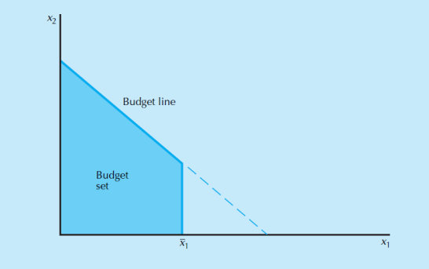

- Suppose a consumer had to pay a tax $t$ on all consumption in excess of $\overline{x}_1$.

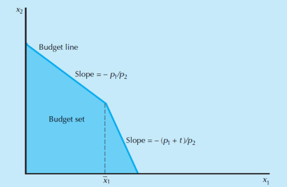

- **Food stamps (食品券)**
  - Popular income support program.
  - Can be legally exchanged only for food.
  - Suppose $m = 100, p_F = 1, p_G = 1$
    - What if 40 food stamps are issued?
    - What if food stamps can be traded on a black market for $0.5 each?

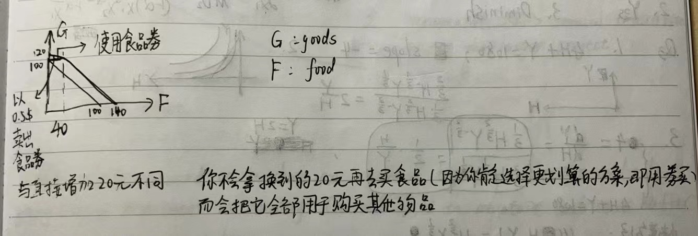

- Consumers choose the most preferred bundle from their budget set.

- Suppose the utility function of a consumer is $u: \mathbb{R}^2_+ \rightarrow \mathbb{R}$. Let $p_1$ and $p_2$ be the  prices and $m$ be his wealth. Then $\text{max}_{x_1, x_2 \geq 0}u(x_1, x_2)$, s.t. $p_1x_1 + p_2x_2 \leq m$

- If $(x^\ast_1, x^\ast_2)$ solves the above utility maximization problem, we call $(x^\ast_1, x^\ast_2)$ an optimal choice.

  - If $x^\ast_1 > 0$ and $x^\ast_2 > 0$: interior optimum (内部最优)

  - Otherwise, it is a boundary optimum (边界最优，边角解)

    *所谓边角解，就是在坐标轴上的点。*

    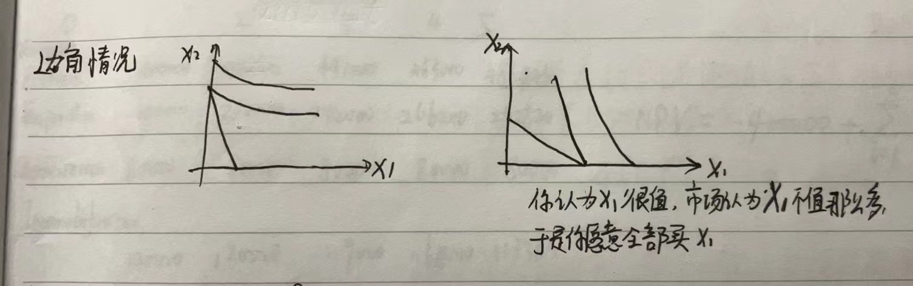

- Optimal choice with well behaved preferences:

  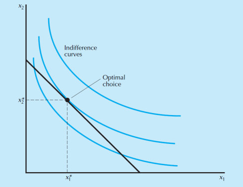

- At point $(x^\ast_1, x^\ast_2)$ indifferent curve is tangent to the budget line so that $\frac{p_1}{p_2} = MRS_{12}(x^\ast_1, x^\ast_2)$

  - If $MRS_{12}(x^\ast_1, x^\ast_2) < p_1/p_2$, then the consumer would like to consume more of good 2.

    *对商品1的心理价位低于市场价格。*

  - If $MRS_{12}(x^\ast_1, x^\ast_2) > p_1/p_2$, then the consumer would like to consume more of good 1.

    *对商品1的心理价位高于市场价格。*

- Another way to is to write $\frac{MU_1}{p_1} = \frac{MU_2}{p_2}$

- The marginal utility of the last penny spent on each good is the same.

  - Consumer is indifferent about how to spend the extra one unit of money.
  - If $\frac{MU_1}{p_1} > \frac{MU_2}{p_2}$, the consumer would like to save one unit of money on good 2 and spend it on good 1.
  - If $\frac{MU_1}{p_1} < \frac{MU_2}{p_2}$, the opposite.

*要严格地解最优化问题，要用到拉格朗日乘数法，如图：*

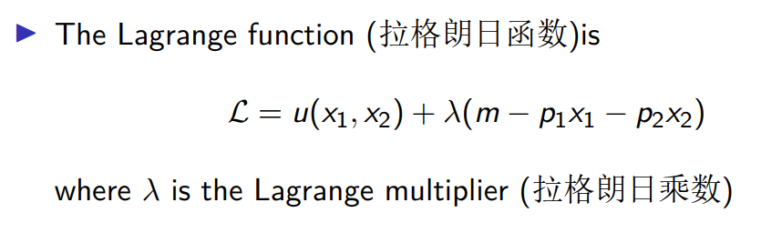

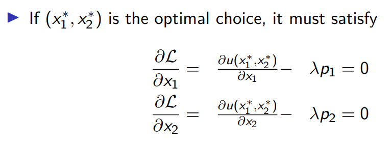

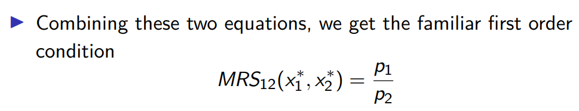

- One obvious advantage of **the method of Lagrange multipliers** is that it is general enough to deal with choices with more than two goods.
- If $(x^\ast_1,...,x^\ast_n)$ is the optimal choice, then it satisfies $\frac{\partial \mathcal{L}}{\partial x_i} = \frac{\partial u(x^\ast_1,...,x^\ast_n)}{\partial x_i} - \lambda p_i = 0$.
- Note the optimal choice appears exactly on the consumer’s budget lines.

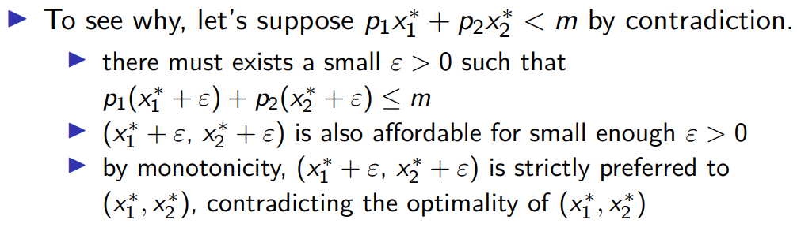

- If the preference is strictly convex, the the optimal choise is unique.

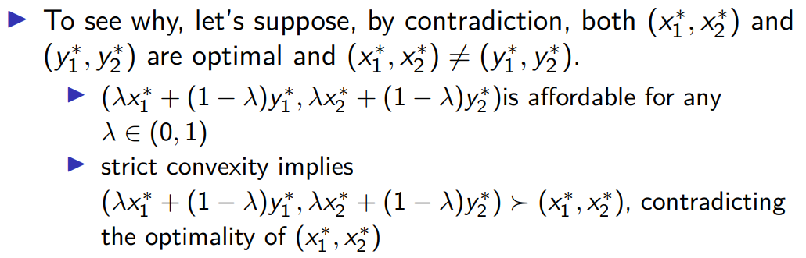

*最优点不在相切处的情况：*

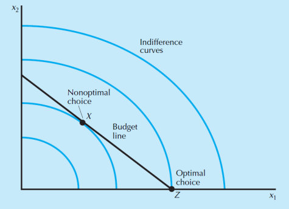

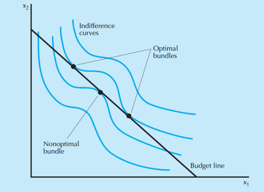

***科布道格拉斯效用函数的最优化问题：***

- Consider the Cobb-Douglas utility function $u(x_1, x_2) = clnx_1 + dlnx_2$.
- The $MRS_{12}(x_1, x_2)$ is $\frac{cx_2}{dx_1}$.
- If prices are $p_1$ and $p_2$, then the first order condition is $\frac{cx^\ast_2}{dx^\ast_1} = \frac{p_1}{p_2}$.
- Because the budget constraint must be binding, we know $p_1x_1 + p_2x_2 = m$
- Hence, we have $x_1^\ast = \frac{cm}{(c + d)p_1}, x_2^\ast = \frac{dm}{(c + d)p_2}$.

*可以认为就是把预算m，按照系数的比例，分给了商品1和2。*

***完全替代的最优化问题：***

- More generally, if $u = ax_1 + bx_2$, we have $MU_1 = a, MU_2 = b$
- If $\frac{a}{b} > \frac{p_1}{p_2}$, consumer will only consume $x_1$, $x_1^\ast = \frac{m}{p_1}, x_2^\ast = 0$.
- If $\frac{a}{b} < \frac{p_1}{p_2}$, consumer will only consume $x_2$, $x_1^\ast = 0, x_2^\ast = \frac{m}{p_2}$.
- If $\frac{a}{b} = \frac{p_1}{p_2}$, the consumer will be indifferent between any combination of the goods as long as he spends all his money.

***完全互补的最优化问题：***

- More generally, if $u(x_1, x_2) = min\{ax_1, bx_2\}$, tangency condition will not hold since indifference curves are not continuous,
  - Slope is either zero, infinity or not defined.
- Consumer will always be on the corner of the indifference curve consuming in fixed proportions $\frac{x_1}{x_2} = \frac{b}{a}$.
- With $p_1x_1 + p_2x_2 = m$, we can solve $x_1^\ast = \frac{bm}{bp_1 + ap_2}, x_2^\ast = \frac{am}{bp_1 + ap_2}$

## 正课三：Consumer's Choice & Comparative Statics 消费者选择与比较静态

日期：2024/9/28

- This section studies how people change their optimal consumption choices when income or the prices of goods changes.
  - Such analysis is known as comparative statics.
- The goal is to analyze the behavior of demand functions.
- Suppose the consumer's preference is monotone (单调) and strictly convex.
  - The consumer's optimal consumption choice given any prices $p = (p_1, p_2)$ and income will be unique and on his budget line.
- The consumer's demand functions give the optimal amounts of each of the goods as a funcion of the prices and income: $x_1(p, m)$ and $x_2(p, m)$.
- **Income effect** refers to the change in optimal consumption due to a change in income, holding prices fixed.

- Normally, we think that the demand for each good would increase when income increases.
  - This is normal goods (正常品).
  - $\frac{\partial x_i}{\partial m} > 0$.
- It is also possible that an increase of income results in a reduction in the consumption of one of the goods.
  - Inferior good (低档品).
  - $\frac{\partial x_i}{\partial m} < 0$
- Low quality goods are usually inferior goods.
- Whether a good is inferior depends on the income level that we are examning.

*收入增加到一定程度后，正常品会变成低档品。*

- Change income m, holding prices constant.

  - Income consumption curve (I.C.C, 收入消费线)/ Income offer curve (收入提供曲线):
    - Income expansion path.
  - Engel curve (恩格尔曲线)
    - Graph of quantity demanded and income.

  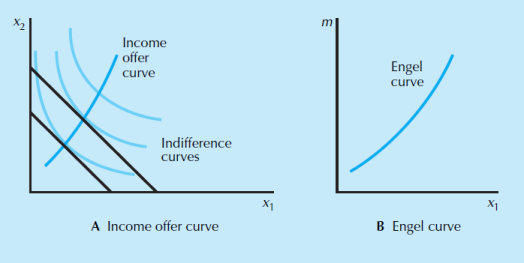

- We can further divide normal goods into different sets based on the relative consumption of different goods changes as income changes.
- Income elasticity of demand (需求的收入弹性) is defined as $e_i = \frac{dQ_d/Q_d}{dI/I} = \frac{I}{Q_d} \frac{dQ_d}{dI}$.

*$Q_d$是对某件商品的需求量，$I$是收入。这个弹性的定义实际上是商品增加的比例比上收入增加的比例。*

- Luxury goods (奢侈品): $e_i > 1$.
- Necessities (必需品): $0 < e_i < 1$.

***完全替代的图像：***

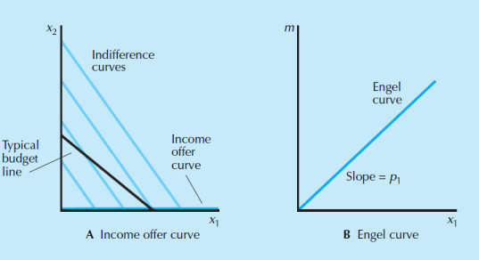

*以上是假设$u(x_1, x_2) = x_1 + x_2$且$p_1 < p_2$的情况，此时最优点在$x_1$轴上，连接得到图A。图B是商品1的恩格尔曲线，画出它需要$x_1$和$m$的关系，我们知道在最优点处（也是消费者的选择处）$x_1 = m/p_1$，既$m = p_1x_1$*

***完全互补的图像：***

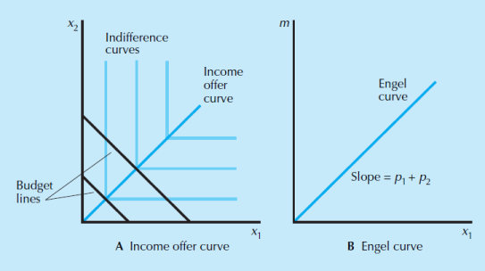

*以上是假设$u(x_1, x_2) = min\{x_1,x_2\}$且$p_1 < p_2$的情况，最优点的商品1 $x_1 = m/(p_1 + p_2)$，因为最优方案一定是配套地购买。*

***科布道格拉斯偏好曲线的图像：***

*以上是假设$u(x_1, x_2) = x_1^ax_2^{1-a}$, 最优点的商品1$x_1 = am/p_1$（由上一课的结论可以很快得出）。*

- Engel curves are straight lines if consumer's preferences are homothetic (同位偏好/相似偏好).
- A consumer's preferences are homothetic if and only if $(x_1, x_2) \succ (y_1, y_2) \Leftrightarrow (kx_1, kx_2) \succ (ky_1, ky_2)$, for every $k > 0$.
- That is, the consumer's MRS is the same anywhere on a straight line drawn from the origin.
- Nonhomothetic example: $u(x_1, x_2) = \sqrt{x_1} + x_2$ (quasilinear preference, 半线性偏好).
- **Price effect** refers to the change in optimal consumption due to a change in price, holding income fixed.
- Focusing on the consumption of one particular good 1, there are two kinds of price changes.
  - Change in its own price
  - Change in the price of the other goods.
- The effects of these two kinds of changes respecitvely are $\frac{\partial x_i}{\partial p_i}$ and $\frac{\partial x_i}{\partial p_k}(k \neq i)$.
- Intuitively ,when the price of a good increases, the demand for this good will decrease, $\frac{\partial x_i}{\partial p_i} < 0$
  - Such a good is an ordinary good (普通商品)

- It is logically possible to find well behaved preferences for which a decrease in the price leads to a reduction in the demand, $\frac{\partial x_i}{\partial p_i} > 0$
  - Such a good is called Giffen good (吉芬商品)

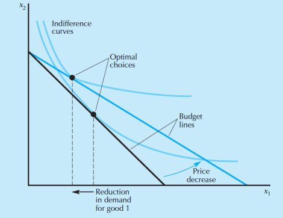

*吉芬商品的例子：假设一个人每天只吃土豆炖牛肉。当土豆价格上涨时，按照原有的购买数量，吃的就减少了。虽然价格上涨，但土豆一定比牛肉便宜，所以为了不减少食物的总量，他反而会去增大土豆的消费。*

- Change the price of one good, holding income and the price of the other good constant.
  - Price consumption curve(P.C.C, 价格消费线)/ Price offer curve (价格提供曲线):
    - contains all utility-maximizing bundles traced out as one price changes.
  - Demand curve
    - Graph of quantity demanded (optimal consumption) and price
    - Limit the study to the relationship between the quantity demanded and changes in the own price of the good.

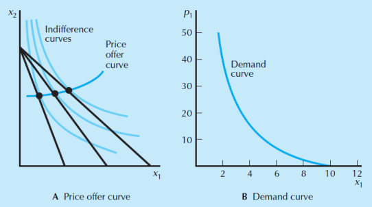

**完全替代的图像：**

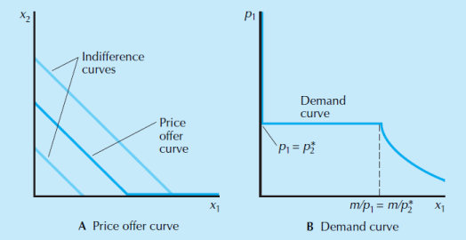

$u(x_1, x_2) = x_1 + x_2$.

*两图的绘制。让预算约束线旋转，即让$p_1$减小，这时最佳选择点在$x_2$截距处，$x_1$数量为0；当$p_1 = p_2$时，或者一般地，$\frac{p_1}{p_2}$等于无差异曲线斜率时，最佳选择点在无差异曲线的线段上，$x_1$可以是一段范围内的任意值；之后，最佳选择点在预算约束线和$x_1$的交点处，$x_1 = \frac{m}{p_1}$，所以B图拐点后是一段反比例函数的曲线。*

*[更多关于作图的讨论 ChatGPT](https://chatgpt.com/c/66fa6897-0d6c-8004-9bd2-023e235bb05d)。注意其中的一个错误，收入固定时无差异曲线不只有一条，无差异曲线是一系列的。*

**完全互补的图像：**

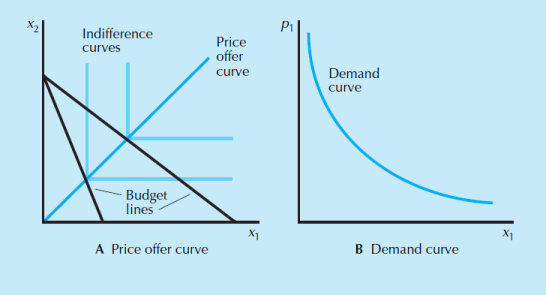

**科布道格拉斯偏好曲线的情况：**

$u(x_1, x_2) = x_1^ax_2^{1-a}$, $x_1 = am/p_1$, $x_2 = (1-a)m/p_2$.

*价格提供曲线，应该是一条水平直线，因为$x_2$是不变的。而需求曲线根据$x_1$的表达式，应该是反比例曲线。*

## 正课四：Comparative Static (II) Slutsky Identity

日期：2024/10/12

- When the price of a good changes, the consumer's budget line rotates accordingly. In this process, two effects arise.

  - Change in relative price
  - Change in the total purchasing power

  *比如一个商品价格增加，你会有两个感觉：一个是特定商品变贵了，你要少买这个，多买那个；另一个是你的购买力似乎下降了*

- To understand the total effect, we can analyze these two effects one by one.

  - step 1: consider only relative price change, without altering the total purchasing power (**substitution effect**, 替代效应)
  - step 2: consider only real purchasing power (实际购买力) change, without changing the relative price from the first stage (**income effect**, 收入效应)

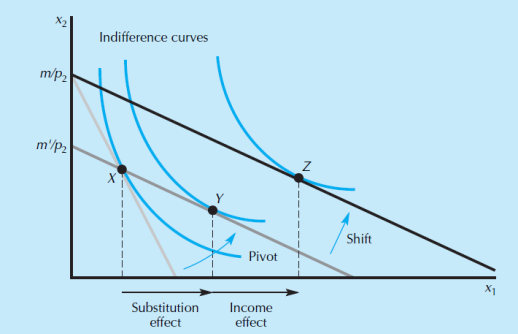

- In step 1, we imagine a change in price from $p_1$ to $p_1'$.

  At the same time, we imagine that the consumer's income also changes so that the original consumpiton $(x_1(p, m), x_2(p, m))$ is still just affordable under $p' = (p_1', p_2)$.

  Therefore, we have $m' = p_1'x_1(p, m) + p_2x_2(p, m)$.

  Under this new budget constraint, the consumer's demand becomes $(x_1(p', m'), x_2(p', m'))$ which is **compensated demand** (补偿需求).

  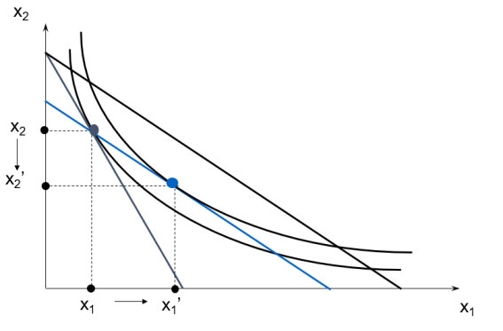

  The change from $(x_1(p, m), x_2(p, m))$ to $(x_1(p', m'), x_2(p', m'))$ is called the **substitution effect**. $\Delta x_1^s = x_1(p_1', m') - x_1(p_1, m)$.

- In step 2, relative price is kept fixed as in step 1, but we alter the consumer's income to his real (and original) income $m$.

  This examine the effect of only purchasing power change.

  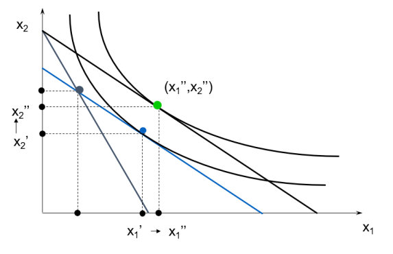

  The change from $(x_1(p', m'), x_2(p', m'))$ to $(x_1(p', m), x_2(p', m))$ is called the **income effect**. $\Delta x_1^n = x_1(p_1', m) - x_1(p_1', m')$

- The price effect can be decomposed into the substitution effect and the income effect.

- In particular,
  $$
  \begin {split}
  \Delta x_1 &= x_1(p', m) - x_1(p, m)\\
  &= [x_1(p', m) - x_1(p', m')] + [x_1(p', m') - x(p, m)]\\
  &= \Delta x_1^n + \Delta x_1^s
  \end {split}
  $$
  This equation is called the **Slutsky identity** (斯勒茨基方程). The sign of $\Delta x_1$ depends on the sign of $\Delta x_1^s$ and $\Delta x_1^n$.

- An important property of substitution effect is the following compensated law of demand: $(p_1' - p_1)[x_1(p', m') - x_1(p, m)] \leq 0$

- To prove the law above, we must use **revealed preference argument** (显示性偏好). It draws conclusion about preferences from behavior.

  let $(x_1, x_2)$ be the original demand and $(x_1', x_2')$ be the compensated demand. We have:
  $$
  m' = p_1'x_1' + p_2'x_2' = p_1'x_1 + p_2'x_2 \tag{4.1}
  $$
  

  Because $(x_1, x_2)$ and $(x_1', x_2')$ are affordable under $(p', m')$ and the consumer chooses $(x_1', x_2')$, we know that the consumer prefers $(x_1', x_2')$.

  But under $(p, m)$, consumer chooses $(x_1, x_2)$ instead of $(x_1', x_2')$. This implies that $(x_1', x_2')$ is not affordable at $(p, m)$:
  $$
  p_1x_1' + p_2x_2' > m = p_1x_1 + p_2x_2 \tag{4.2}
  $$
  

  Combining $4.1$ and $4.2$ we have $(p_1' - p_1)(x_1' - x_1) < 0$.

- We've proved that $(p_1' - p_1) \Delta x_1^s < 0$ and we want to know the sign of $(p_1' - p_1) \Delta x_1^n$.

  - If $p_1' < p_1$, $(p_1' - p_1) \Delta x_1^n \leq 0$ requires $\Delta x_1^n \geq 0$, which indicates that demand increase when income increase. It is **normal good**.
  
    Since <u>both</u> the substituion and income effects increase demand when own-price decrease, the demand cruve for a normal good <u>must</u> slope downwards. 
  
  - If $p_1' < p_1$, $(p_1' - p_1) \Delta x_1^n \geq 0$ requires $\Delta x_1^n \leq 0$, which indicates that demand decrease when income increase. It is **inferior good**.
  
    The substitution and income effects <u>oppose</u> each other when a good's own price changes. The income effect may be larger in size than the substitution effect, causing quantity demanded to decrease as own-price decreases. Such goods are called **Giffen goods**.
  
  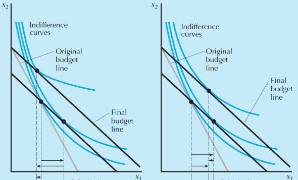
  
  *左图为吉芬商品的情况*
  
- we know that any price change can be decomposed into two changes：

  - a substitution effect that is sure to be negative.
  - an income effect whose sign depends on wether the good is a normal good or an inferior good.

- exact "**the law of demand**": If the demand for a good increases when income increases, then the demand for that good must decrease when its price increases.

## 正课五：Consumer Surplus & Market Demand 消费者剩余和市场需求

日期：2024/10/19

- Last lecture, we've studied the Slutsky substitution effect. It hold the consumer's purchasing power constant by making the original bundle remains affordable.

- **Hicks substitution effect** hold the consumer's purchasing power constant by making the consumer can purchase <u>a bundle that is indifferent to his original bundle</u>.

  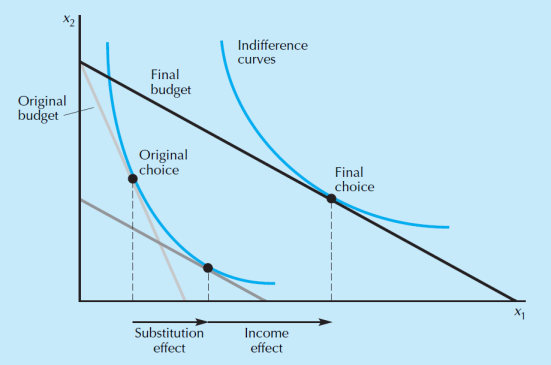

- We want to measure consumers gain (or welfare) from trading at single price or policy change.

- Let's consider an example of a consumer's choices over gasoline and a composite good denominated in dollars.

  *这是中微里常用的研究方法。关注一个商品，其他的商品看作一个整体，并用美元作为单位表示它的“大小”。*

  Now let's ask the question: how much would the consumer be willing to pay for the opportunity to participate in the current market for gasoline?

- We look at each gallon of gasoline that the consumer consumes and how much the consumer would have been willing to pay for that gallon.

  We derives **Marginal Willingness to Pay (MWTP)** from MRS of indifference curve.
  
  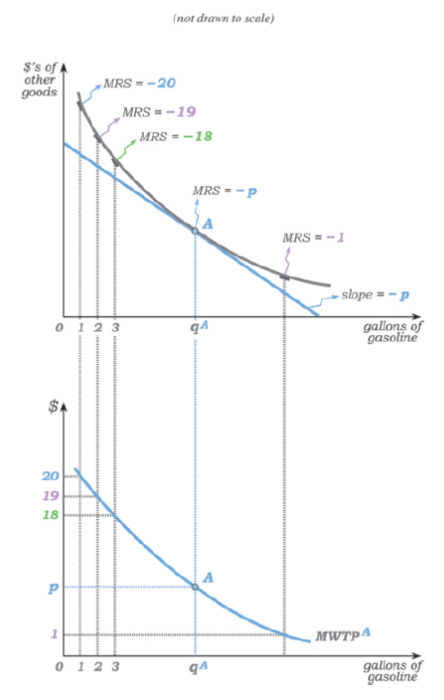

- *我们接着探讨MWTP和其他曲线的关系*

  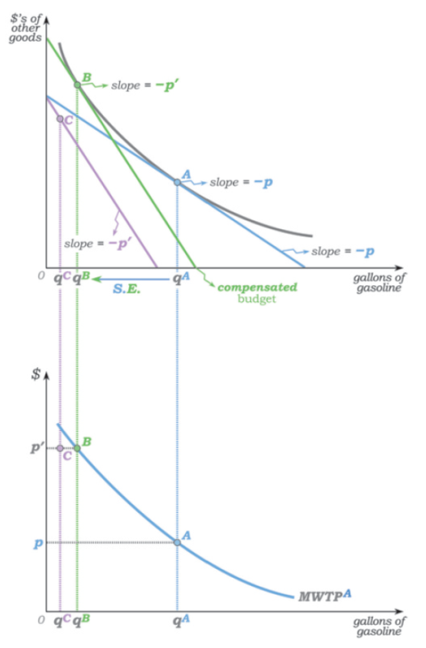

  *如图是价格上升的情况。因为Hicks substitution effect造成的点B和点A都在同一条无差异曲线上，对于任意价格都如此，所以最终**MWTP曲线和补偿需求曲线（compensated demand curve）完全重合**。*

  Unfortunately, the MWTP curves are not observable.

  *因为补偿需求曲线是一条假想的曲线，现实中存在的是需求曲线*

  The graph illustrate the difference between the MWTP curves and the demand curve, <u>they are generally not the same</u> (point B is usually different from point C)

  - They would be the same when there are no income effects.
  - True only for tastes that are <u>quasilinear</u> in that good.

- A quasilinear utility function takes the form of $u(x_1, x_2) = v(x_1) + x_2$. Assuming $p_2 = 1$, demand for $x_1$ can be soleved from $v'(x_1) = p_1$, the simplified form of $MRS = \frac{p_1}{p_2}$. There is a "zero income effect" for good 1.

  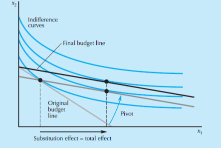

- Relationship of demand and MWTP Curves for $x_1$:

  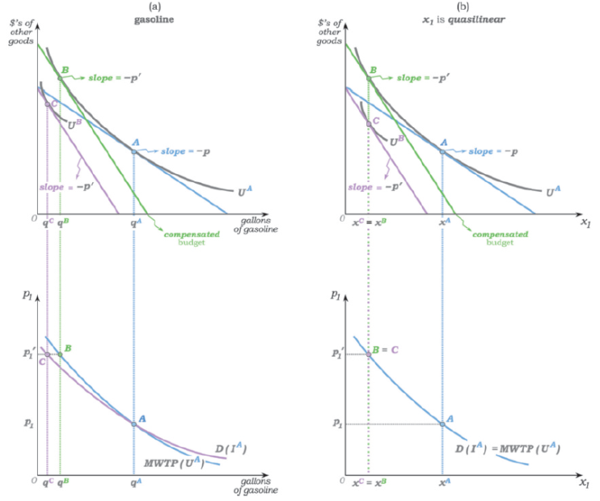

- We sometimes say that a consumer's demand curve is just his marginal utility curve. This relies on quasilinear utility function.

- The consumer's total willingness to pay for all the gasoline purchased is equal to

  - marginal willingness to pay for the first gallon + his marginal willingness to pay for the second gallon + ...
  - roughly equal to the area below the MWTP curve up to the quantity that he consumes.

- The amount he actually had to pay is simply equal to $p$ times the number of gallons he chose to consume.

- The gains from trade is 

  - the difference between what the consumer was willing to pay and what he actually paid for his gasoline consumption.
  - is called the **consumer surplus** (消费者剩余).

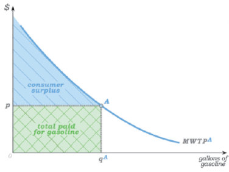

- To see the inefficiency of taxation, we will try to answer the following question:
  - How much would a taxed individual be willing to bribe the goverenment to get the tax rescinded?
- We will compare this amount with the amount that the individual is actually paying in tax.
  - If larger, then there exists a way that the government could have raised more revenue without making anyone worse off
  - the difference between these two is our measure of **deadweight loss** (无谓损失).

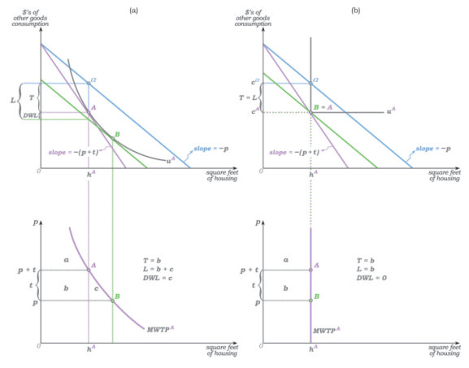

*先研究左图这种一般情况。最初的预算约束线是蓝色的（斜率为-p），征税后变成紫色的 [斜率为-(p+t)] ，绿色图线代表的是消费者宁愿给政府交钱也不愿改变消费习惯的情况，所以斜率是-p，收入减少，减少的程度最多等于征税带来的收入效应。*

*征税后，消费者选择购买$h^A$加仑的汽油。而在原来，买同样的汽油却能多买\$$T$的其他商品，其他商品减少的价钱就是政府收走的税。但是实际上，你感受到的损失是\$$L$，这是你愿意牺牲的最大代价，也就意味着征税这件事在你心中的成本是$L$。*

*$DWL = L - T$, 这些钱你感觉失去了，但政府却没有收到，它们凭空消失了，这就是无谓损失*

*右图是完全互补的情况，没有替代效应，$T = L$*

- **Compensating variation**
  - how much money we would have to give the consumer <u>after</u> the price change to make him just as well off as he was before the price change.
- **Equivalent variation**
  - how much money would have to be taken away from the consumer <u>before</u> the price change to leave him as well off as he would be after the price change.

*EV实际上对应前面说的bribe*

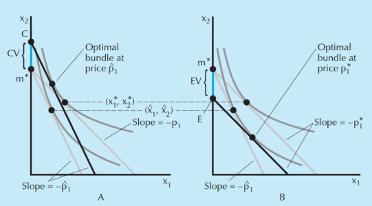

- Individual $i$ has a demand function good k as $x_1^k = D_i^k(p, m_i)$. The market demand for good $k$ is $X^k(p, m_1, m_2, ..., m_n) = \sum^{n}_{i = 1} D_i^k(p, m_i)$
- If all consumers have identical preference that are homothetic, the $X^k(p, m_1, m_2, ..., m_n) = X^k(p, M)$, where $M = \sum^n_{i = 1} m_i$

## 正课六：Choice under Uncertainty

日期：2024/10/26

A proposition that takes the value True with probability $\pi$ and False with probability $1 - \pi$ is random variable with distribution.

- The (probability) distribution of a random variable $X$ with n values is $(\pi_1, \pi_2, ..., \pi_n)$, with $\pi(X = x_i) = \pi_i$ and $\sum^n_{i = 1} \pi_i = 1$

  * $X$ is a state reached after doing an action A under uncertainty

- The expected value of $X$ after doing A is $E[X] = \sum^n_{i = 1} \pi_i x_i$.

- When we consider consumer's choices under uncirtainty, the basic element is consumption **lotteries**.

- A lottery over $X$ can be written as $p_1 c_1 + p_2 c_2 + ... + p_n c_n$, where $n \geq 1$ is a finite integer and $c_1, ..., c_n \in X$, $(p_1, p_2, ..., p_n)$ is a probability distribution.

- How do we evaluate lotteries?
  $u(p_1 c_1 + p_2 c_2 + ... + p_n c_n) = p_1 v(c_1) + p_2 v(c_2) + ... + p_n v(c_n)$

   $u$ is sometimes called a von Neumann-Morgenstern utility function **(冯诺伊曼效用函数)** and $v$ is called a **Bernoulli utility function**

  The consumer's expected utility from a lottery is simply the expected value of his utility from the realized outcomes.

  $u(L) = E[v(c)]$

- Based on expected utility, we can talk about consumers' risk attitude.

  1. **Risk aversion** (风险规避)

     - consumer <u>prefers certainty</u> to any lottery that yields the same expected wealth.

     - $v$ is concave.

       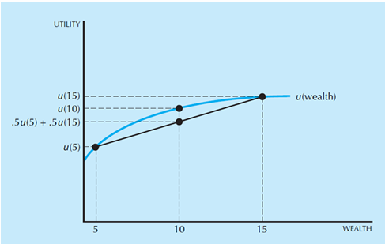

       *图片中的u就是上面指称的v；“.5”是“0.5”*

       the expected utility of wealth is <u>less</u> than the utility of the expected value of wealth

  2. **Risk loving** (风险偏好)

     - consumer <u>prefers random</u> lottories that yield the same expected wealth to certainty.

     - $v$ is convex.

       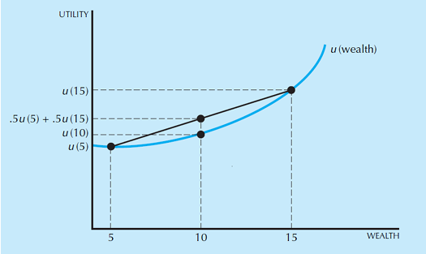

       the expected utility of wealth is <u>greater</u> than the utility of the expected value of wealth

  3. **Risk neutral** (风险中性)

     - <u>indifferent</u> between any gambles (random or nonrandom) that yield the same expected wealth.
     - $v$ is linear.

- **Certainty Equivalent (CE, 确定性等值)**

  - It is the amount of money obtained with certainty, which gives the same utility as the expected utility of an uncertain outcome.
  - $v(CE) = p_1v(c_1) + (1 - p_1)v(c_2)$

- The Cost of Risk: **Risk Premium (风险升水)**

  - the difference between the Expected Wealth of an action and the Certainty Equivalant
  - $RP = [p_1c_1 + (1 - p_1)c_2] - CE$

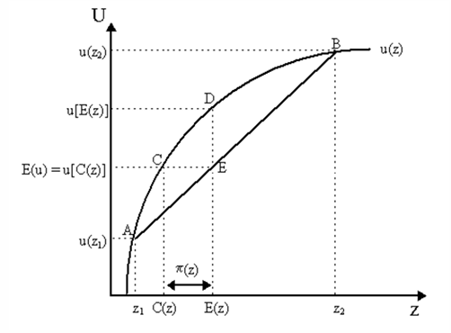

- Risk averse individual:

  - the horizontal EU line reaches the concave utility curve before it reaches the vertical line that corresponds to the expected value.
  - so risk premium is positive

- Case: Insurance

  - a risk averse consumer who has an initial wealth of $w$ but runs a risk of a loss of $D$. The probability of loss is $\pi$. One unit of insurance costs $p$ dollars and pays 1 dollars if the loss occurs. How many units of insurance should the consumer buy?

  - the wealth of the consumer

    - if the loss occurs, $w - \alpha p + \alpha + D$
    - if no loss, $w - \alpha p$

    His expected wealth is $w - \pi D + \alpha(\pi - p)$

    and the expected utility is $\pi v(w - \alpha p + \alpha + D) + (1 - \pi) v(w - \alpha p)$

  - If the price $p$ is fair, $p = \pi$. So the expected becomes $w - \pi D$

  - The consumer's problem is maximizing his expected utility ($\alpha > 0$)

  - Since he is risk averese, $\pi v(w - \alpha p + \alpha + D) + (1 - \pi) v(w - \alpha p) \leq v(w - \pi D)$.

    *消费者的风险偏好相当于告诉了他的效用函数的凹凸性。*

  - We find that when $\alpha = D$, two sides are equal, thus the greatest expected utility. $\alpha = D$ is optimal for the consumer.

  - When he purchase $D$ units of insurance, the loss was fully covered by the insurance. No matter there is loss or not, his wealth is $w - \pi D$. The consumer <u>get rid of any uncertainty by insurance</u>.

## 正课七：Technology

日期：2024/11/2

*从本节课开始进入消费者理论。*

### 1. Technology

- A firm uses some inputs to produce outputs.
  - inputs are also called "factors of production" (生产要素)
  - example: labor ($L$) (skilled, unskilled); physical capital ($K$) (有形资本) (equipment, structures, inventories, land); intangibles (无形资本)
- Suppose a firm uses $n$ inputs to produce an output.
- A **technology** is represented by <u>a production function</u> $f: \mathbb{R}^n_+ \rightarrow \mathbb{R}_+$ that maps every possible combination of inputs $(x_1, x_2, ..., x_n)$ to its <u>maximum possible output</u> $f(x_1, ..., x_n)$.
- We consider production functions with two inputs. The idea for production here is the same as utility function
  - isoquant curves (等产量线)

*等产量线和无差异曲线类似，它们有同样的性质，比如不同的等产量线一定不相交。但是它们也有区别，一是求解最优化问题时，等产量线是约束，不能动；二是产量和效用不同，它的大小有实际意义，不仅仅是序数含义，进一步而言，不能对技术函数做单调变换。*

### 2. Examples of Technology

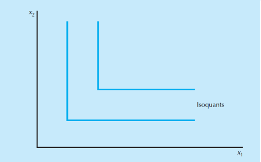 **Fixed portions**: $f(x_1, x_2) = min\{x_1, x_2\}$

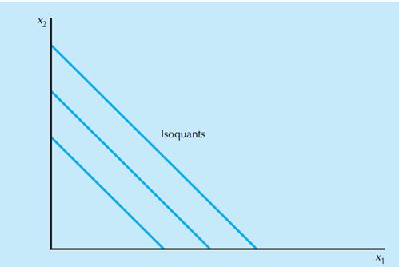 **Perfect substitute**: $f(x_1, x_2) = x_1 + x_ 2$

- **Cobb-Douglas production function**: $f(x_1, x_2) = Ax^a_1 x^b_2$

  - $A > 0$: the scale of production, i.e., how much output we would get if we used one unit of each input.
  - $a > 0$ and $b > 0$: two inputs' respective share of output.
  - $A$ measures the portion of output not explained by $x_1$ and $x_2$.
  - It is often called **total factor productivity (TFP)**.

  *这里的$A,a,b$的大小都是有意义的，不能像utility function那样随意改变*

### 3. Properties of Technology

- We say a technology is monotonic (单调) if its producion function is increasing
  - if you increase the amount of at least one of the inputs, it should be possible to produce at least as much output as you were producing originally.

*单调性假设建立在free disposal（废品免费处置）之上*

- We say a technology is convex (凸的) if for any output level $y$, the set $\{(x_1, x_2)|f(x_1, x_2) \geq y\}$ is convex.

  - suppose input bundles $x$ and $x'$ both provide $q$ units
  - then the mixture $tx + (1 - t)x'$ provides at least $q$ units of output for all $t \in (0, 1)$.
  - if $f$ is concave, then the technology is convex.

  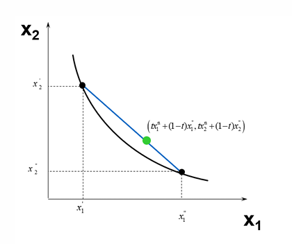

- Similarly, the marginal product (边际产出) of an input measures how many more output can be produced if one more unit of this input is used.

  - The marginal product of input 1 is $MP_1(x_1, x_2) = \frac{\partial f(x_1, x_2)}{\partial x_1}$

### 4. Law of Diminishing Product

- As more of a variable input is added to a fixed input, additions to output get smaller and smaller: $\frac{\partial MP_1}{\partial x_1} = f_{11} < 0$, $\frac{\partial MP_2}{\partial x_2} = f_{22} < 0$

  *多数情况下成立，但不绝对。比如下面这种情况。*

  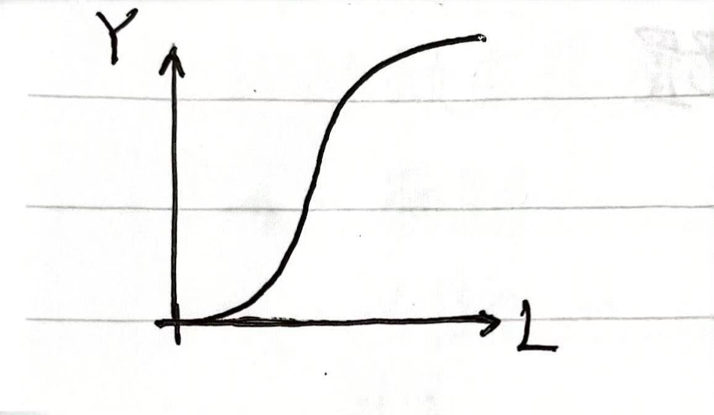

### 5. Technical Rate of Substitution

- **The technical rate of substitution** (技术替代率) of input 1 for input 2 at input level $(x_1, x_2)$ is

  *多少个1可以换一个2*

  $$TRS_{12}(x_1, x_2) = \frac{MP_1(x_1, x_2)}{MP_2(x_1, x_2)}$$

- The idea is the following:

  - suppose the firm is producing $f(x_1, x_2)$ units of output
  - if we decrease one unit of input 1, how many units of input 2 shall we increase to keep the same output level?

- Mathematically, $TRS_{12}(x_1, x_2)$ is the slope of the isoquant curve at $(x_1, x_2)$.

*C-D函数是技术替代率递减的，对应图像上斜率绝对值减少*

### 6. Returns to Scale (规模报酬)

- A production function exhibits **constant returns to scale** (规模报酬不变) if

  $$ f(tx_1, tx_2) = tf(x_1, x_2)$$

  for any $(x_1, x_2)$ and $t > 1$.

- In words, if we scale all of the inputs up by some amount $t$, constant returns to scale implies that we should get $t$ times as much output.

- A production function exhibits **increasing returns to scale** (规模报酬递增) if

  $$ f(tx_1, tx_2) > tf(x_1, x_2)$$

  for any $(x_1, x_2)$ and $t > 1$.

- A production function exhibits **decreasing returns to scale** (规模报酬递减) if

  $$ f(tx_1, tx_2) < tf(x_1, x_2)$$

  for any $(x_1, x_2)$ and $t > 1$.

*规模报酬图像上的含义是两个等产量线的间距。*

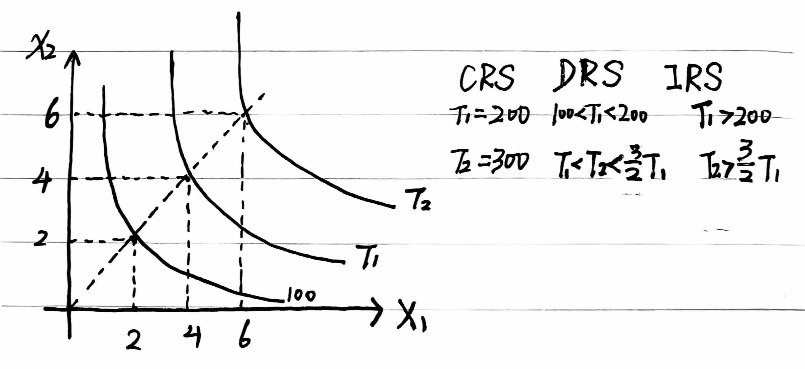

*为什么会有规模报酬的不同？这与产业特性和生产阶段有关。钢铁、计算机、手工制造业就分别属于递增、不变、递减的情况。产业发展初期，往往是递增；往后发展逐渐变成不变或递减。*

### 7. Long Run and Short Run

- **Short run** means a certain period of time during which at least one input can not be changed.
- **Long run** means a long period of time during which all inputs can be changed.
- Capital (land, factories, machines, etc) usually can only be changed in the long-run, while labor can be easily changed in the short-run

## 正课八：Profit Maximization & Cost Minimization Problem

- There are two ways to investigate firm’s profit maximization problem.
- One is a <u>direct</u> approach.

- The other is an <u>indirect</u> approach.
  - we divide a firm’s profit maximization problem into two stages.
  - one is **cost minimization** and the other is **profit maximization**.

### 1. Competitive Markets and Price Takers

- We assume that firms are price takers (价格接受者) in both market for the factors of production it uses and market for the output goods it produces.
- Markets in which firms take prices as given are called competitive markets (竞争性市场).
- The justification for price taking behavior is large markets.
  - because there are many many participants in the same market, each individual participant only have negligible effect on the market price

### 2. Profits

- Suppose a firm sells $y$ units of output at price $p$.

- To produce these outputs, the firm uses inputs $(x_1,...,x_n)$ at price $(w_1,..., w_n)$.

- The profits the firm receives can be expressed as

  $$\pi = py - \sum^n_{i = 1}w_i x_i$$

  - $py$ is the firm’s revenue.
  - $\sum^n_{i = 1}w_i x_i$ is total cost.

- In the expression for cost, we should be sure to include <u>all of the factors</u> of production used by the firm, valued at their market price.

  - if an individual works in his own firm, then his labor is an input and it should be counted as part of the costs.
  - his wage rate is simply the market price of his labor

- Economic costs like these are often referred to as <u>opportunity costs</u>.

*也就是说，计算profit时的成本是机会成本。*

### 3. Short-Run Profit Maximization

- Let’s consider the short-run profit-maximization problem when input 2 is fixed at some level $x_2$.

- $f(x_1, x_2)$ is the production function for the firm, then the profit maximazation can be written as:

$$
\max_{x_1} pf(x_1, \bar{x_2}) - w_1x_1 - w\bar{x_2}
$$

- The first order condition is 
  $$
  p MP_1(x_1^*, \bar{x_2}) = w_1
  $$
  *通过对前一个式子求导得到。实际含义是增加一单位input 1的边际收益（左）等于边际成本（右）*

- *接下来研究图像表示。我们的目标是最大化$\pi$。为了作图，我们需要对公式变形。*
  $$
  y = \frac{\pi}{p} + \frac{w_2}{p}\bar{x_2} + \frac{w_1}{p}x_1
  $$
  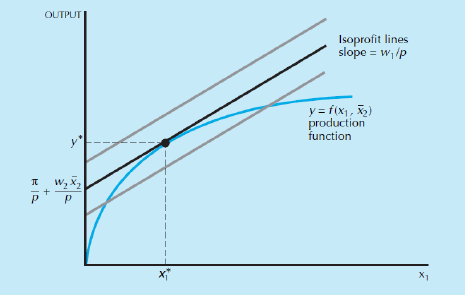

  It is **isoprofit lines** (等利润线).

  *因为$w_1, w_2, p$是不变的，所以其截距大小就反映了$\pi$的大小。我们通过上下移动等利润线找到最大的$\pi$。*

- *研究两个有趣的情况*

  1. *增大$w_1$*。首先斜率增大，切点左移，所以截距也减小。即$x_1^*, y^*, \pi$都减小。
  2. *降低$p$。图像变化同上。$x_1^*, y^*$减小，但$\pi$未知。*
  3. *增大$w_2$。斜率不变，所以切点不变，直线仍在原来位置。即$x_1^*, y^*$不变，$\pi$减小。*

  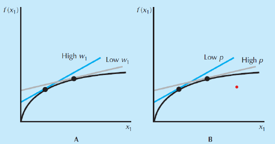

### 4. Long-Run Profit Maximization

- In the long run, the firm is free to choose the level of all inputs.

- Thus, the long-run profit-maximization problem can be posed as
  $$
  \max_{x_1, x_2} pf(x_1, x_2) - w_1x_1 - w_2x_2
  $$

- The first order condition is 
  $$
  p MP_1(x_1^*, x_2^*) = w_1 \\
  p MP_2(x_1^*, x_2^*) = w_2
  $$

### 5. Cost Minimization vs. Profit Maximization

- If a firm choose a profit maximization production plan, there is no way to produce the same amounts of outputs at a lower total input costs.

  - cost minimization is a <u>necessary</u> condition for profit maximization.

- Reasons to study firm’s cost minimization problem.

  - leads us to a number of results that are technically useful.

  - when the firm is <u>not a price taker</u>, we can no longer use the profit funtion for analysis.

    *这意味着厂商可以改变价格来增大利润*

  - if the production set exhibits nondecreasing returns to scales, the profit maximization problem dose not work well

    *这意味着厂商可以通过不断扩大规模来增大利润*

- We now consider the **cost minimization** problem.
  $$
  \min_{x_1, x_2} w_1x_1 + w_2x_2 \\
  s.t. \bar{y} = f(x_1, x_2)
  $$
  *$\bar{y}$是一个给定产量。这是一个给定约束的最优化问题。*

  Using Lagrange method, $\mathcal{L} = w_1x_1 + w_2x_2 + \lambda [\bar{y} - f(x_1, x_2)]$, we know
  $$
  \frac{w_1}{w_2} = \frac{MP_1}{MP_2} = TRS_{12}
  $$

- Suppose that we want to plot all the combinations of inputs that have some given level of cost $C$. We can write this as $w_1x_1 + w_2x_2 = C$, which can be rearranged to give $x_2 = \frac{C}{w_2} - \frac{w_1}{w_2} x_1$

  As we let the number $C$ vary we get a whole family of isocost lines.

  The choice of factors that minimize production costs can be determined by finding <u>the point on the isoquant that has the lowest associated isocost curve</u>.

  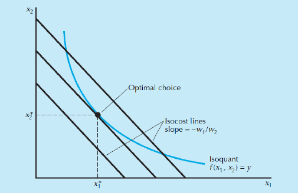

- *求解成本最小化的流程，已知指定产量，生产要素价格，生产函数：*
  1. 由$\frac{w_1}{w_2} = TRS_{12}$得出最优化条件
  2. 代入生产函数求$x_1$或$x_2$
  3. 求出生产成本

#### (1) Cobb-Douglas Technology

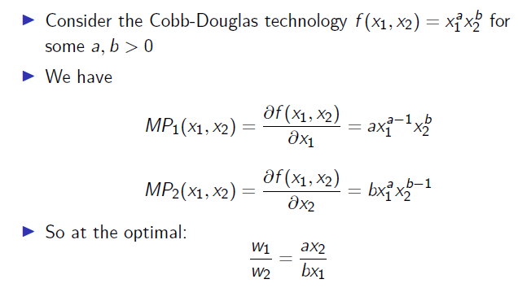

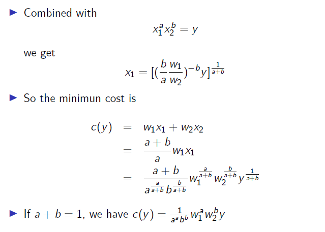

#### (2) Perfect Complements

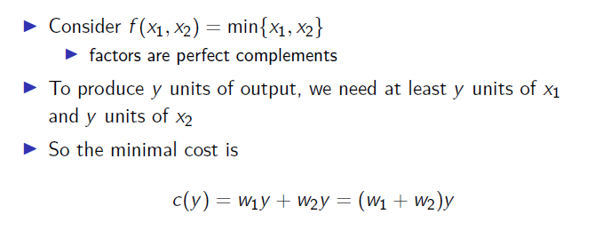

#### (3) Perfect Substitution

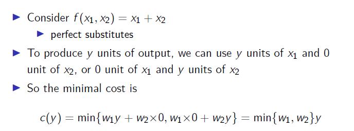

*根据经验和图像，我们知道完全替代的情况下，最优选择只会是只投入其中一种生产要素。所以我们对这两种情况的成本取最小值。*

- How about $f(x_1, x_2) = x_1 + 2x_2$?

  $c(y) = \min \{w_1y + w_2 \times 0, w_1 \times 0 + w_2 \frac{y}{2}\} = \min \{w_1, \frac{w_2}{2}\} y$

## 正课九：Supply & Partial Equilibrium

日期：2024/11/23

### 1. Market environment

- Four examples of market environment:
  - monopoly (垄断)
    - only one firm in this market
    - the only seller determines the quantity supplied/the market-clearing price
  - oligopoly (寡头)
    - a few firms that sell identical products
    - the decisions of each influence the payoffs of the other firms
  - monopolistic competition (垄断性竞争)
    - many firms that sell slightly different products
    - each firm's output level is small relative to the total
  - **pure competition** (完全竞争)
    - There are many buyers and sellers
    - homogeneous product (同质产品)
    - freedom of entry and exit (进入与退出自由)
    - perfect information (完全信息)
    - Firms become price takers (**competitive firms**), <u>all they have to worry about is how much to produce</u>.

### 2. Firm's supply curve

- Consider a competitive firm with a cost function $c(y)$.

- If the market price is $p$, then the firm's profit maximization problem is
  $$
  \max_{y \geq 0} py - c(y) \tag{1}
  $$

- A necessary condition (from the method of Lagrange multipliers) is 
  $$
  p \leq MC(y) \text{, with equality if } y> 0
  $$

- The equation $p = MC(y)$ gives us the **inverse supply function** (*供给函数的反函数*).

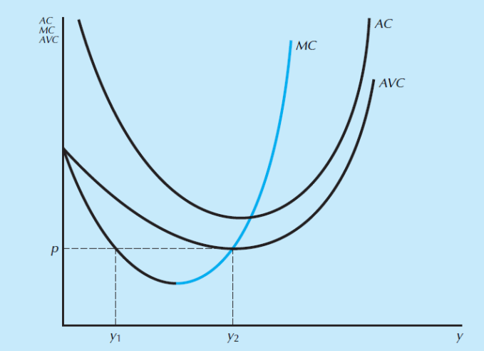

- There is a problem that we have several levels of output where $p = MC(y)$, which one to choose.
- For the first intersection:
  - the $MC$ curve is sloping down
  - increasing output raises profits
- The supply curve of a competitive firm <u>must lie along the upwardsloping part</u> of the $MC$ curve.

*另一种数学上的解释是：如果上面的最优化问题$(1)$通过求导来求最值，由最值处导数为零也可以得出$P = MC$，但是要确保这个最值是最大值，需要二阶导小于零，即$-MC'(y) < 0$，这也说明供给曲线是$MC$曲线的上升部分。*

- Sometimes, however, it could be that the best thing for a firm to do is to shut down (停工).

- The firm is better off going out of business when $-F > py - c_v(y) - F$.

- Rearranging this equation gives us the  shutdown condition
  $$
  AVC(y) > p
  $$

- The supply curve is the upward-sloping part of the $MC$ curve that lies above the $AVC$ curve.

*紧承上文的数学解释：这实际上排除了最大值小于端点值（$y = 0$）的情况。*$P \times 0 - c(0) > Py^*- c(y^*)$, 即$c(y^*) - c(0) > Py^*$。*这是取最大值的情况，$AVC(y) > p$说的是所有的$y$，两者等价。*

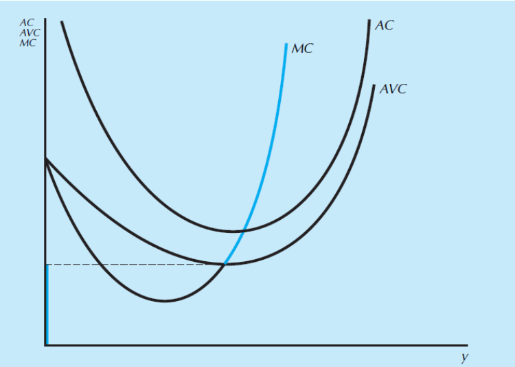

*实际上，上述讨论仍不完备。我们已经研究了极值存在的情况下，最值的两种可能性（取极值点处和取端点处）；但是还没有研究极值点不存在的情况，即$P < MC(y), \forall y$。这是显而易见的，它意味着利润函数的导数恒小于零，即单调递减，所以最大利润在$y=0$时取得。这种情形在计算时不用单独说明，可以与$AVC(y) > p$的情况合并。具体见下面的例子*

- Example:

  - Assuming a firm's short-run cost function is $c_s(y) = 0.1y^3 - 2y^2 + 15y + 10$, what is its supply curve?
    $$
    P = MC(y) = 0.3y^2 - 4y + 15, y = \frac{4+\sqrt{1.2p - 2}}{0.6} \\
    \text{由求根公式反解出$y$，有两个根，我们取较大解，对应单调递增阶段}\\
    P \leq AVC(y) = 0.1y^2 - 2y + 15, y \leq 10\\
    \text{这一步将$P = MC(y)$代入,可以求解出$y$的取值范围}\\
    y \leq 10 \Rightarrow P \leq MC(10) = 5 \Rightarrow y = 0, \text{when $P \leq 5$}\\
    \text{需要注意，我们上面求的是$y$的取值范围，而我们需要的是$P$，所以要代回$MC(y)$，最后我们得出了}\\
    \text{取端点值的条件。实际上，我们在上面的过程中合并了取端点值和极大值不存在两种情况，完整步骤}\\
    \text{应该是由$y \leq 10$得出$MC(y)_{min} \leq P \leq MC$, 再讨论$P \leq MC(y)_{min}$,但是因为二者都是$y = 0$}\\
    \text{的情况，所以合并了。}
    $$

### 3. Profits and Producer's surplus

- The **producer surplus** is the <u>sum over all units</u> produced of the <u>difference between the market price of the good and the marginal cost of production</u>.
  $$
  \begin{align}
  PS &= \int_{0}^{y*} P - MC(y) \tag{2}\\
  &= Py - C(y) |_0^{y^*}\\
  &= Py^* - C(y^*) + C(0)\\
  &= Py^* - C_v(y^*) \tag{3}
  \end{align}
  $$

- 

- Therefore, we have $PS = Py - C_v(y) = \pi + F$, $y$ is the units of output.

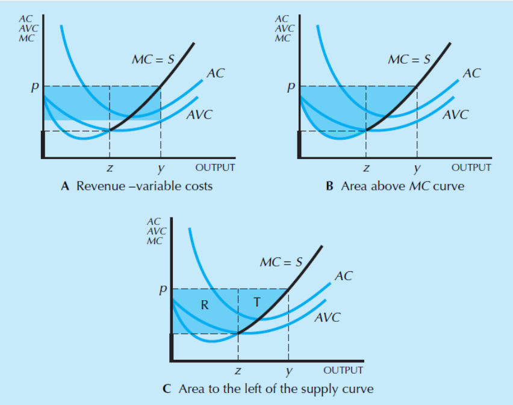

